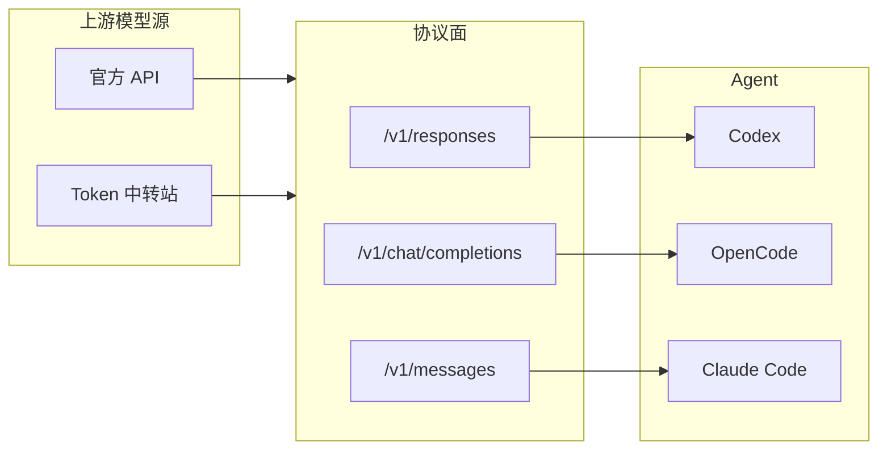
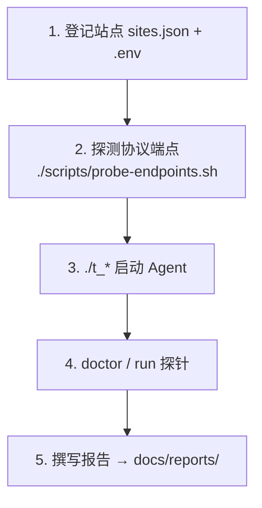

# API Compatible — 上游模型源 × Coding Agent 兼容性评估

在 **上游模型源** 与 **Coding Agent 运行时**（Codex、Claude Code、OpenCode 等）之间，评估 **协议是否对齐、能否端到端跑通**。

| 上游类型 | 说明 | 示例 |
|----------|------|------|
| **云厂商 / 模型平台 API** | 官方直连 | OpenAI、Anthropic、Bedrock、Azure OpenAI |
| **Token 中转站** | 聚合/转售，常裁剪端点 | b.ai、New API、One API、LiteLLM |

本仓库提供：**站点注册 + 启动器 + 评估方法论**，不是 SDK。  
具体测试结果见 **[docs/reports/](./docs/reports/)**。

---

## 目录与文件

```
api_compatible/
├── README.md                      # 项目总览（本文件）
├── AGENTS.md                      # 协作规则（改代码 / 提交前必读）
├── sites.json                     # 上游站点注册（无密钥）
├── .env.example                   # 密钥环境变量模板 → 复制为 .env
├── opencode.json.example          # OpenCode 手工配置示例（可选）
│
├── t_claude                       # 启动 Claude Code（Messages API）
├── t_codex                        # 启动 Codex CLI（Responses API）
├── t_opencode                     # 启动 OpenCode（Chat Completions）
│
├── lib/
│   ├── maas.sh                    # 启动器共享逻辑（安装检测、选站、exec）
│   └── maas.py                    # sites.json 解析、拉模型、写临时配置
│
├── scripts/
│   ├── pull-upstream.sh           # 按需拉取 opencode / newapi 参考源码
│   └── probe-endpoints.sh         # 探测站点 HTTP 端点（协议矩阵）
│
└── docs/reports/                  # 兼容性评估报告（按站点 × Agent）
```

### 本地生成 / 不提交 Git

| 路径 | 用途 |
|------|------|
| `.env` | API Key（从 `.env.example` 复制） |
| `.claude/settings.json` | `t_claude` 按站点写入的配置 |
| `.runtime/codex.*.toml` | `t_codex` 临时配置 |
| `.runtime/opencode.*.json` | `t_opencode` 临时配置 |
| `opencode.json` | 手工 OpenCode 配置（可选；含密钥时不提交） |
| `opencode/`, `newapi/` | 上游参考源码（`scripts/pull-upstream.sh` 拉取） |

完整规则见 **[AGENTS.md](./AGENTS.md)**。

---

## 快速开始

```bash
cp .env.example .env          # 填入 sites.json 里 api_key_env 对应的 Key
./t_opencode --list-sites     # 查看已注册站点
./t_claude                    # 交互：选站点 → 选模型 → 启动 Agent
./t_claude --site b.ai --model claude-haiku-4.5 -y
./t_codex --help
```

启动器会在 CLI 未安装时**自动安装**（Claude Code / Codex / OpenCode），并写入对应临时配置。  
需要对照上游实现时再执行：`./scripts/pull-upstream.sh`。

### 代理 / v2rayN（大陆网络）

v2rayN **TUN 全局**有时不覆盖终端；本机 SOCKS 在 `127.0.0.1:10808` 时，启动器会**自动**设置 `HTTPS_PROXY=socks5h://127.0.0.1:10808`（`socks5h` 让 DNS 也走代理，避免 114 DNS 污染）。也可在 `.env` 写 `MAAS_PROXY=...`，或 `MAAS_PROXY_SKIP=1` 关闭。

```bash
./scripts/check-bai-network.sh   # 对比直连 vs 代理
./scripts/probe-endpoints.sh b.ai
```

若仅浏览器能上网、终端超时：在 v2rayN 打开**自动配置系统代理**，或保持使用 `./t_*`（已注入代理环境变量）。

新增站点：编辑 [`sites.json`](./sites.json) 与 `.env.example`，详见 [AGENTS.md § 新增上游站点](./AGENTS.md#新增上游站点)。

---

## 核心结论（协议优先）

> Key 有效、`/v1/models` 可达 **≠** Agent 可用。必须先对齐 **Agent 要求的 HTTP 端点**。

| Agent | 硬性依赖的 API | 典型配置 |
|-------|----------------|----------|
| **Codex** 0.133+ | `/v1/responses` | `OPENAI_BASE_URL`, `OPENAI_API_KEY` |
| **Claude Code** | `/v1/messages` | `ANTHROPIC_BASE_URL`, `ANTHROPIC_API_KEY` |
| **OpenCode** | `/v1/chat/completions` | `OPENCODE_CONFIG` / Provider 配置 |



---

## 评估流程



跑完探针后，将结论写入 [docs/reports/](./docs/reports/)，README 保持工具说明，不嵌入具体测试结果。

---

## 扩展

**新增 Agent**：仿 `t_*` + `lib/maas.sh` 中 `maas_run_*`，并在 `docs/reports/` 新增报告。  
**评估云厂商 API**：先映射到上表协议面，再接入 `./t_*`。  
**评估中转站**：额外核对是否裁剪 `/v1/responses`、Base URL 形态、模型 ID。

---

## 许可证

- 本仓库的启动器与方法论以本仓库维护为准。
- `opencode/`、`newapi/` 为可选上游参考源码，遵循各自许可证；通过 `scripts/pull-upstream.sh` 拉取，不纳入 Git。

---

**一句话**：上游分两类、协议少、Agent 各取所需 — 用同一套探针回答 **这条链路能不能让你的 Coding Agent 跑起来**。
