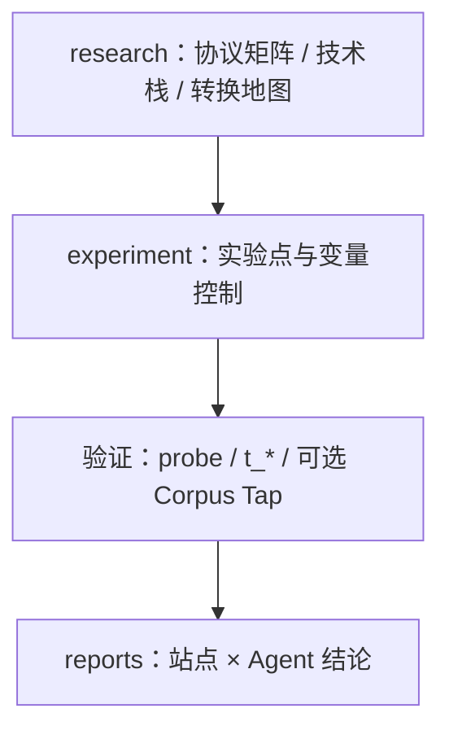

# API Compatible — 研究：Coding Agent × 上游模型源兼容性

本仓库是 **研究项目**，不是 SDK、不是中转站产品。核心产出是 **文档**（调研、实验设计、评估报告）；根目录代码是 **可复现的验证手段** 与 **插件设计原型**，服务于研究结论而非独立交付。

## 研究问题

在接入 **上游模型源**（云厂商官方 API 或 Token 中转站）之前，能否判断 **Coding Agent**（Codex、Claude Code、OpenCode 等）在该链路上 **协议对齐、端到端可跑**？

| 维度 | 关注点 |
|------|--------|
| **协议面** | Agent 硬性依赖的 HTTP 端点（如 `/v1/responses`、`/v1/messages`）与中转站是否裁剪、转换 |
| **中转站栈** | New API / One API / LiteLLM 等实现差异与探测方法 |
| **网关转换** | 协议桥接方案地图（非「能 curl 通」即兼容） |
| **实验可复现** | 用户侧隔离 Runner、中转站原型 EC2、出站审计与语料采集 |
| **实证** | 站点 × Agent 的 L2–L5 结论与复现步骤 |

> Key 有效、`/v1/models` 可达 **≠** Agent 可用 — 这是研究的主线判断，详见 [E2E 原生兼容性全景](./docs/research/E2E原生兼容性全景.md)。

---

## 产出结构（主阅读路径）

完整索引：[docs/README.md](./docs/README.md)

| 层级 | 目录 | 角色 |
|------|------|------|
| **调研** | [docs/research/](./docs/research/) | 理论基线：协议矩阵、中转站技术栈、转换插件地图 |
| **实验设计** | [docs/experiment/](./docs/experiment/) | 云上实验点：用户侧 Runner、中转站原型、语料采集插件契约 |
| **评估报告** | [docs/reports/](./docs/reports/) | 站点 × Agent **实测结论**（研究证据，不写在 README 里） |

建议阅读顺序：

1. [E2E 原生兼容性全景](./docs/research/E2E原生兼容性全景.md)  
2. [中转站主流技术栈调研](./docs/research/中转站主流技术栈调研.md)（若评估 Token 站）  
3. [EC2-中转站原型实验点设计](./docs/experiment/EC2-中转站原型实验点设计.md) → [EC2-用户侧隔离实验点设计](./docs/experiment/EC2-用户侧隔离实验点设计.md)  
4. 结论对照 [docs/reports/](./docs/reports/)

---

## 代码在仓库中的角色

代码 **不** 定义项目边界；用于 **执行** 文档中的实验设计与探针，便于他人复现。

| 类型 | 路径 | 作用 |
|------|------|------|
| **验证脚本** | `scripts/probe-endpoints.sh`、`scripts/run-user-side-compat.sh` 等 | L2 端点探测、用户侧 Runner 自动化 smoke |
| **Agent 启动器** | `t_claude` / `t_codex` / `t_opencode`、`lib/maas.*` | 按 `sites.json` 注入配置，驱动真实 CLI 做 L3–L5 |
| **站点登记** | `sites.json`、`.env.example` | 无密钥的实验对象注册表 |
| **插件原型** | [corpus-tap/](./corpus-tap/) | [中转站语料采集插件设计](./docs/experiment/中转站语料采集插件设计.md) 的 Go 骨架（透明代理 + 落库） |
| **参考源码** | `scripts/pull-upstream.sh` → `opencode/`、`newapi/`、`codex/` | 对照上游实现（本地拉取，不提交 Git） |

PoC 脚本（如 `poc-litellm-bai-codex.sh`）仅用于探索性验证，不构成产品接口。

---

## 研究方法（概要）



| 阶段 | 文档 | 代码（可选） |
|------|------|----------------|
| 建立基线 | `docs/research/` | — |
| 设计实验 | `docs/experiment/` | 云上拓扑、凭据、出站策略 |
| 执行探测 | 实验点 § 操作说明 | `probe-endpoints.sh`、`run-user-side-compat.sh`、`t_*` |
| 语料 / 对照 | [语料采集插件设计](./docs/experiment/中转站语料采集插件设计.md) | `corpus-tap/` 插在中转站前端 |
| 归档结论 | `docs/reports/` | — |

**环境分工**：E4 兼容性自动化在 **用户侧 EC2 Runner** 上跑 `t_*`；**中转站原型 EC2** 用于建站、发 Token 与可选语料采集，**不** 作为 `t_*` 的常规运行环境。详见 [EC2-用户侧隔离实验点设计](./docs/experiment/EC2-用户侧隔离实验点设计.md)。

---

## 仓库布局

```
api_compatible/
├── docs/                          # ★ 主产出
│   ├── research/                  # 调研与参考
│   ├── experiment/                # 实验点与插件设计
│   └── reports/                   # 评估报告
│
├── t_*、lib/、scripts/            # 验证与复现（从属 docs）
├── sites.json、.env.example       # 实验对象登记
└── corpus-tap/                    # 语料采集插件原型
```

协作与 Git 规则：[AGENTS.md](./AGENTS.md)。

---

## 复现验证（从属章节）

需要 **复现** 某份报告或实验点中的步骤时，再使用下列命令；日常阅读以 `docs/` 为主。

```bash
# 本机调试 Agent（见 reports 中具体站点）
cp .env.example .env
./t_claude --site b.ai --model claude-haiku-4.5 -y

# 用户侧 EC2 Runner
./scripts/run-user-side-compat.sh --site b.ai --probe-only
./scripts/run-user-side-compat.sh --site newapi-prototype --smoke
```

- 启动器细节、代理（v2rayN）、新增站点：见 [AGENTS.md](./AGENTS.md) 与历史工具说明（`MAAS_PROXY`、`check-bai-network.sh`）。  
- Corpus Tap 本地运行：[corpus-tap/README.md](./corpus-tap/README.md)。

---

## 协议速查（指向调研）

| Agent | 硬性 API | 深度阅读 |
|-------|----------|----------|
| Codex 0.133+ | `/v1/responses` | [Codex 兼容性评估报告](./docs/reports/Codex兼容性评估报告.md) |
| Claude Code | `/v1/messages` | [Claude Code 兼容性评估报告](./docs/reports/ClaudeCode兼容性评估报告.md) |
| OpenCode | `/v1/chat/completions` | reports 索引 |

矩阵与版本基线：[E2E 原生兼容性全景](./docs/research/E2E原生兼容性全景.md)。

---

## 扩展研究

| 方向 | 先写 / 改文档 | 再按需改代码 |
|------|----------------|--------------|
| 新上游类型或站点 | `docs/research/` 或 `docs/reports/` | `sites.json`、`t_*` |
| 新 Agent | `docs/research/` 矩阵 + 新报告卷 | 新 `t_<agent>` |
| 新实验点或出站策略 | `docs/experiment/` | Runner / 网关侧脚本或 Compose |
| 语料采集规则 | [中转站语料采集插件设计](./docs/experiment/中转站语料采集插件设计.md) | `corpus-tap/` |

---

## 许可证

- 文档与方法论以本仓库维护为准。  
- `opencode/`、`newapi/`、`codex/` 为可选参考源码，遵循各自许可证；`scripts/pull-upstream.sh` 拉取，不纳入 Git。

---

**一句话**：研究 **Agent 与上游是否真兼容** — 证据在 `docs/`，代码只是验证与插件设计的复现附件。
