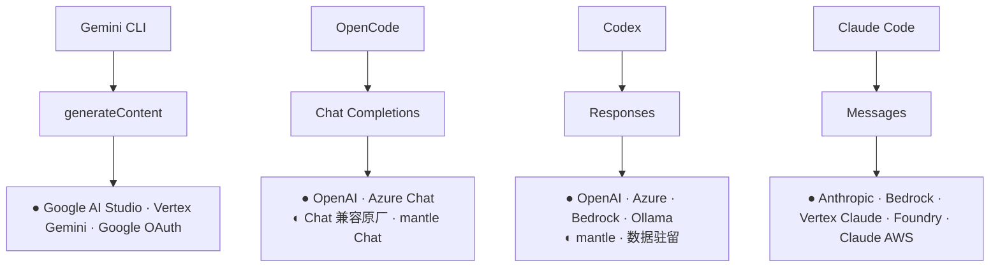
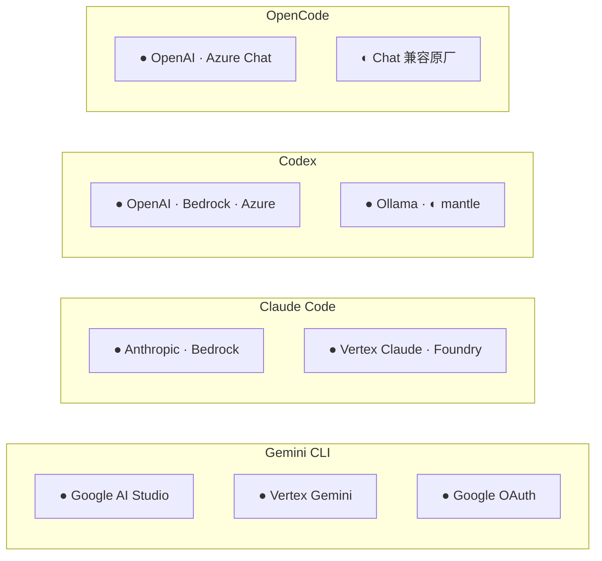
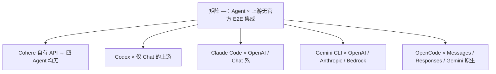

# E2E 原生兼容性全景

> **文档类型**：参考矩阵 · **范围**：原厂 / 云托管上游 × 四 Agent（Claude Code、Codex、OpenCode、Gemini CLI）· **不含** 中转站与自建网关  
> **厂商会持续改版**，以官方文档为准。表中 **●** 表示 L1+L2 原生对齐；L3–L5 实测见 [reports/](./reports/)。

### 文档元信息

| 项 | 内容 |
|----|------|
| **编写日期** | 2026-06-03 |
| **矩阵基线** | 依据各 Agent / 上游 **官方集成文档** 整理；L3–L5 以 [reports/](./reports/)（2026-06-01 实测）为参照 |
| **复审触发** | 任一下列 **评估标的** 大版本升级、官方新增/废弃 provider、或上游 API 改版 |

### 评估标的版本（矩阵所依）

| 标的 | 版本 / 门槛 | 来源 |
|------|-------------|------|
| **Claude Code CLI** | `2.1.159` | [ClaudeCode 兼容性评估报告](./reports/ClaudeCode兼容性评估报告.md)（2026-06-01） |
| **Codex CLI** | `0.133.0` 起（`wire_api = "responses"` 唯一）；报告测 `0.133.0`，当时最新已知 `0.135.0` | [Codex 兼容性评估报告](./reports/Codex兼容性评估报告.md) |
| **OpenCode CLI** | `1.15.13` | [OpenCode 兼容性评估报告](./reports/OpenCode兼容性评估报告.md) |
| **Gemini CLI** | `0.45.0`（`@google/gemini-cli`） | [官方 npm](https://www.npmjs.com/package/@google/gemini-cli)（2026-06-03）；**尚无** 本仓库 reports 实测 |

### 协议 / 上游参照版本（附录 curl 与集成说明）

| 参照项 | 版本或取值 |
|--------|------------|
| Anthropic Messages | Header `anthropic-version: 2023-06-01` |
| Azure OpenAI（Codex Responses 示例） | Query `api-version=2025-04-01-preview` |
| Codex 主 wire | `wire_api = "responses"`（**0.133 起**强制，Chat Completions 已移除） |
| Gemini API | Path `/v1beta/models/{model}:generateContent` · `:streamGenerateContent` |

> 上游模型 ID、区域开通与 Bedrock mantle 能力以各云控制台为准，不单独锁定版本号。

---

## 目录

1. [定义与评估维度](#1-定义与评估维度)
2. [四 Agent 主 wire 要求](#2-四-agent-主-wire-要求)
3. [兼容性总矩阵](#3-兼容性总矩阵)
4. [Agent 官方集成补充](#4-agent-官方集成补充)
5. [上游补充说明](#5-上游补充说明)
6. [关系图](#6-关系图)
7. [附录：L2 连通性示例](#7-附录l2-连通性示例)

---

## 1. 定义与评估维度

### 1.1 E2E 原生兼容

同时满足下列三项，记为 **●（E2E 原生）**：

| 条件 | 含义 |
|------|------|
| **Agent 官方集成** | Agent 官方文档中的 provider、`config.toml` 块或环境变量（非自建 HTTP 代理） |
| **上游原生协议面** | 该集成所对接的上游 **官方** Base URL、端点与鉴权 |
| **E2E 能力闭环** | 除主推理 HTTP 200 外，Agent 默认工作流所需的 **流式、tool 多轮、鉴权链** 可成立 |

```text
E2E 原生兼容  =  Agent 官方集成  ×  上游官方协议面  ×  Agent 工作流能力闭环
```

### 1.2 图例与评估分层

| 符号 | 含义 |
|------|------|
| **●** | E2E 原生：官方集成 + 主 wire 对齐（L1+L2） |
| **◐** | 半原生：主 wire 协议族一致，路径 / 模型 ID / 鉴权 / 区域有差异 |
| **—** | 无官方 E2E 路径（协议族不同或无官方集成） |

| 层级 | 检查内容 | 通过含义 |
|------|----------|----------|
| L1 | Agent 是否有官方集成指向上游 | 选型可行 |
| L2 | 主 wire 端点 HTTP 可达 | 最小连通 |
| L3 | 流式（SSE / WebSocket / eventstream） | 交互不挂起 |
| L4 | tool / function 多轮回传 | Agent 能改代码、跑命令 |
| L5 | reasoning、thinking、vision 等 | 高级特性可用 |

**§3 矩阵仅覆盖 L1+L2。** L3–L5 因 Agent 版本、区域、模型而异，以 [reports/](./reports/) 为准。

---

## 2. 四 Agent 主 wire 要求

| Agent | 主推理协议 | 主端点 | L3–L4 典型依赖 |
|-------|------------|--------|----------------|
| **Claude Code** | Anthropic Messages | `POST /v1/messages` | SSE；`tool_use` / `tool_result`；`anthropic-version` |
| **Codex**（`0.133.0` 起） | OpenAI Responses | `POST /v1/responses` | SSE 或 WebSocket Responses；agentic tools |
| **OpenCode** | OpenAI Chat Completions | `POST /v1/chat/completions` | SSE；`tool_calls` 流式 |
| **Gemini CLI** | Gemini Generate Content | `POST .../models/{model}:generateContent` · `:streamGenerateContent` | 流式 SSE；function calling / 内置工具；`@google/genai` SDK |

四 Agent **各绑一种协议族**，不会跨族自动切换。Codex 自 **0.133.0** 起仅 `wire_api = "responses"`；Gemini CLI 经 **`generateContentConfig`**（`.gemini/settings.json`）配置 thinking 等参数，非 OpenAI `/v1/*`。

---

## 3. 兼容性总矩阵

| 上游 | Claude Code | Codex | OpenCode | Gemini CLI | 官方集成要点 |
|------|:-----------:|:-----:|:--------:|:----------:|--------------|
| **Anthropic API** | ● | — | — | — | Claude：默认 · `/v1/messages` |
| **OpenAI API** | — | ● | ● | — | Codex / OpenCode |
| **Azure OpenAI** | — | ● | ● | — | deployment 名；Codex `wire_api = "responses"` |
| **Microsoft Foundry** | ● | — | — | — | `CLAUDE_CODE_USE_FOUNDRY=1` |
| **AWS Bedrock（runtime）** | ● | ● | — | — | `USE_BEDROCK` · `amazon-bedrock` |
| **Bedrock mantle** | ● | ◐ | ◐ | — | Claude `USE_MANTLE`；Codex 无内置 mantle |
| **Vertex AI（Claude）** | ● | — | — | — | `CLAUDE_CODE_USE_VERTEX=1` |
| **Claude Platform on AWS** | ● | — | — | — | `CLAUDE_CODE_USE_ANTHROPIC_AWS=1` |
| **Ollama / LM Studio** | — | ● | — | — | `codex --oss` |
| **OpenAI 数据驻留** | — | ◐ | — | — | `[model_providers.openaidr]` |
| **DeepSeek / Moonshot 等** | — | — | ◐ | — | 仅 OpenAI Chat |
| **Google AI Studio（Gemini API）** | — | — | — | ● | `GEMINI_API_KEY` · AI Studio |
| **Vertex AI（Gemini）** | — | — | — | ● | `GOOGLE_GENAI_USE_VERTEXAI` · ADC / 服务账号 / Cloud API Key |
| **Google 账号 OAuth** | — | — | — | ● | 交互式 `/auth`（Gemini CLI 内置） |

**常见结论**

- Claude Code ↔ Anthropic / Bedrock / Vertex（Claude）/ Foundry / Claude AWS → **●**
- Codex ↔ OpenAI / Azure Responses / Bedrock / Ollama → **●**；Codex ↔ 仅 Chat 上游 → **—**
- OpenCode ↔ OpenAI / Azure Chat / Chat 兼容原厂 → **● / ◐**
- **Gemini CLI ↔ Google AI Studio / Vertex（Gemini）/ Google OAuth → ●**；与其它三 Agent 的 OpenAI / Anthropic 上游 → **—**

> **产品线说明**：Google 正将部分消费者档位终端体验迁移至 **Antigravity CLI**（`agy`）；**Gemini CLI**（开源 `@google/gemini-cli`）仍服务 Enterprise / GCP 等场景。矩阵以 Gemini CLI 官方认证文档为准，见 [§4.4](#44-gemini-cli)。

---

## 4. Agent 官方集成补充

矩阵见 [§3](#3-兼容性总矩阵)。本节仅列 **配置入口与官方文档**。

### 4.1 Claude Code

| 集成 | 配置 |
|------|------|
| Anthropic API | 默认 · `ANTHROPIC_API_KEY` 或 OAuth |
| Amazon Bedrock | `CLAUDE_CODE_USE_BEDROCK=1` + `AWS_REGION` |
| Bedrock Mantle | `CLAUDE_CODE_USE_MANTLE=1` |
| Vertex AI | `CLAUDE_CODE_USE_VERTEX=1` + `ANTHROPIC_VERTEX_PROJECT_ID` + `CLOUD_ML_REGION` |
| Microsoft Foundry | `CLAUDE_CODE_USE_FOUNDRY=1` |
| Claude Platform on AWS | `CLAUDE_CODE_USE_ANTHROPIC_AWS=1` + workspace |

文档：[Environment variables](https://code.claude.com/docs/en/env-vars) · [Bedrock](https://code.claude.com/docs/en/amazon-bedrock) · [Vertex](https://code.claude.com/docs/en/google-vertex-ai)

### 4.2 Codex

| 集成 | 配置 |
|------|------|
| OpenAI | `model_provider = "openai"`（内置） |
| Amazon Bedrock | `model_provider = "amazon-bedrock"` + `[model_providers.amazon-bedrock.aws]` |
| Azure OpenAI | `[model_providers.azure]` · `wire_api = "responses"` · `api-version` |
| Ollama / LM Studio | `codex --oss` |
| 数据驻留 / mantle | 自定义 `[model_providers.*]` |

文档：[Advanced Configuration](https://developers.openai.com/codex/config-advanced) · [Codex on Azure](https://learn.microsoft.com/en-us/azure/foundry/openai/how-to/codex)

### 4.3 OpenCode

通过 **OpenAI 兼容 provider 配置** 对接上游，无与 Claude Code / Codex 同级的云厂商 env 开关。

- **●**：OpenAI、Azure Chat 等原厂 Chat 面，字段满足 L3–L4 时记 ●。
- **◐**：DeepSeek、Moonshot、Bedrock mantle Chat 等 **原厂 OpenAI Chat 兼容**；能否 E2E 取决于字段完整度。

文档：[OpenCode Providers](https://opencode.ai/docs/providers)

### 4.4 Gemini CLI

**主 wire**：Gemini **`generateContent` / `streamGenerateContent`**（`@google/genai` SDK，非 OpenAI `/v1/*`）。

| 集成 | 配置 | 上游 Base |
|------|------|-----------|
| **Google AI Studio** | `GEMINI_API_KEY` | `generativelanguage.googleapis.com` |
| **Google 账号** | 交互式登录 / `/auth` | 同上（按账号配额） |
| **Vertex AI（Gemini）** | `GOOGLE_GENAI_USE_VERTEXAI=true` + `GOOGLE_CLOUD_PROJECT` + `GOOGLE_CLOUD_LOCATION` | 区域 Vertex endpoint |
| Vertex · ADC | `gcloud auth application-default login`；须 **unset** `GEMINI_API_KEY` / `GOOGLE_API_KEY` | GCP 项目凭据 |
| Vertex · 服务账号 | `GOOGLE_APPLICATION_CREDENTIALS` 指向 JSON | 同上 |
| Vertex · Cloud API Key | `GOOGLE_API_KEY`（部分组织策略可能禁用） | 同上 |

配置目录：`~/.gemini/`（如 `settings.json`、`.env`）。模型与 thinking 等见 `modelConfigs` / `generateContentConfig`。

文档：[Gemini CLI 认证](https://geminicli.com/docs/get-started/authentication/) · [Generation settings](https://geminicli.com/docs/cli/generation-settings/) · [GitHub](https://github.com/google-gemini/gemini-cli)

**与其它 Agent 的关系**：Gemini CLI **不**原生消费 Anthropic Messages、OpenAI Chat/Responses；OpenAI 系三 Agent **不**原生消费 Gemini `generateContent`。

---

## 5. 上游补充说明

### Amazon Bedrock

| Runtime | 说明 |
|---------|------|
| **runtime** | Claude Code / Codex 经 **官方 SDK** 对接（Converse / Invoke 等），非裸 `/v1/*`。 |
| **mantle** | OpenAI / Anthropic 兼容路径；Claude Code `USE_MANTLE`；Codex 需自定义 provider。 |

文档：[Bedrock 端点](https://docs.aws.amazon.com/bedrock/latest/userguide/endpoints.html)

### Microsoft Azure

- Azure OpenAI：Responses（Codex）、Chat（OpenCode）；`model` = deployment 名。
- Foundry：Anthropic 面 → Claude Code。

### Google

| 部署 | Claude Code | Gemini CLI |
|------|:-----------:|:----------:|
| **Vertex AI（Claude）** | ● | — |
| **Google AI Studio / Gemini API** | — | ● |
| **Vertex AI（Gemini）** | — | ● |

Base URL 示例：`https://generativelanguage.googleapis.com/v1beta`（AI Studio）；Vertex 为区域化 `aiplatform` endpoint。

### 国产 OpenAI Chat 兼容原厂

DeepSeek、Moonshot 等：OpenCode **◐**；Codex **—**；Claude Code **—**；Gemini CLI **—**。

---

## 6. 关系图

### 6.1 Agent → 主 wire → 上游



### 6.2 官方集成一览



### 6.3 无原生 E2E 集成的典型组合

与 [§6.1](#61-agent--主-wire--上游)、[§6.2](#62-官方集成一览) 互补：下列 **Agent × 上游** 在官方集成中 **无** 原生对接，矩阵记 **—**。



---

## 7. 附录：L2 连通性示例

用于 **L2 主 wire** 核对；**不**代表 L3–L5 E2E 通过。

### 鉴权对照

| 上游 | 典型鉴权 |
|------|----------|
| OpenAI | `Authorization: Bearer` |
| Anthropic / mantle Messages | `x-api-key` + `anthropic-version: 2023-06-01` |
| Azure OpenAI | `api-key` Header |
| Bedrock mantle | Bedrock API Key |
| Gemini API（AI Studio） | `x-goog-api-key` 或 query `?key=` |
| Vertex AI（Gemini） | GCP OAuth / ADC / 服务账号 |

### curl 示例

**Gemini generateContent（Gemini CLI）**

```bash
curl "https://generativelanguage.googleapis.com/v1beta/models/gemini-2.5-flash:generateContent" \
  -H "x-goog-api-key: $GEMINI_API_KEY" \
  -H "Content-Type: application/json" \
  -d '{"contents":[{"parts":[{"text":"Reply OK"}]}]}'
```

**OpenAI Responses（Codex）**

```bash
curl https://api.openai.com/v1/responses \
  -H "Authorization: Bearer $OPENAI_API_KEY" \
  -H "Content-Type: application/json" \
  -d '{"model":"gpt-5","input":"OK","max_output_tokens":16}'
```

**OpenAI Chat（OpenCode）**

```bash
curl https://api.openai.com/v1/chat/completions \
  -H "Authorization: Bearer $OPENAI_API_KEY" \
  -H "Content-Type: application/json" \
  -d '{"model":"gpt-4o","messages":[{"role":"user","content":"OK"}],"max_tokens":16}'
```

**Anthropic Messages（Claude Code）**

```bash
curl https://api.anthropic.com/v1/messages \
  -H "x-api-key: $ANTHROPIC_API_KEY" \
  -H "anthropic-version: 2023-06-01" \
  -H "Content-Type: application/json" \
  -d '{"model":"claude-sonnet-4-20250514","max_tokens":64,
       "messages":[{"role":"user","content":"OK"}]}'
```

---

[← 返回项目总览](../README.md)
