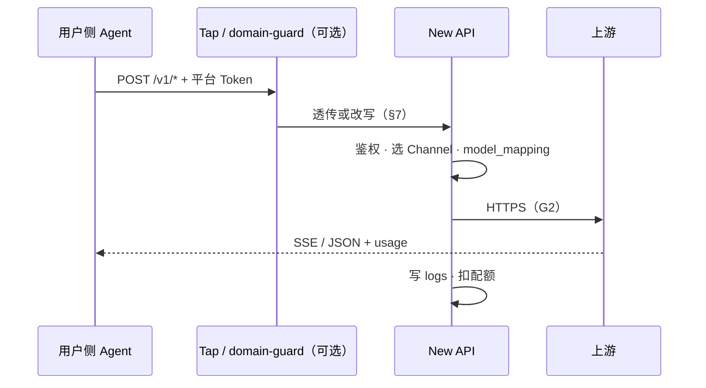

# EC2 中转站原型实验点设计

> **文档类型**：实验方法论 · **非** 兼容性认证报告（网关侧指标与抽样 probe 可记入 reports；**三 Agent L3–L5 主结论在用户侧 Runner 完成**）  
> **范围**：境外 AWS EC2 部署 **New API** 中转站原型：Channel 接 Anthropic / OpenAI / 同区域 Bedrock；下发 **平台 Token + API 入口** 供 [用户侧实验点](./EC2-用户侧隔离实验点设计.md) 登记为 `sites.json` 站点  
> **分工**：[用户侧稿](./EC2-用户侧隔离实验点设计.md) 负责 Runner、N1–N3、L3–L5；本文负责 **运营商侧建站、出站 G1–G2、交付**  
> **调研**：[中转站主流技术栈调研](../research/中转站主流技术栈调研.md)（E1 产品栈）· [NewAPI 技术栈全景](../research/NewAPI技术栈全景.md)（源码导读）  
> **可选增强**：[Corpus Tap](./中转站语料采集插件设计.md) · 技术域边界（§7.1）

### 文档元信息

| 项 | 内容 |
|----|------|
| **编写日期** | 2026-06-03 |
| **状态** | 设计稿（基础设施待实施） |
| **调研基线** | New API `v1.0.0-rc.9`（实施时锁定镜像 tag / digest） |
| **复审触发** | New API 大版本、Channel/Bedrock 策略、SG/出站、域边界策略、Corpus Tap 规则变更 |

---

## 目录

1. [实验点定位](#1-实验点定位)
2. [实验要回答的问题](#2-实验要回答的问题)
3. [逻辑架构](#3-逻辑架构)
4. [评估维度（网关侧）](#4-评估维度网关侧)
5. [部署与 Compose](#5-部署与-compose)
6. [New API 配置](#6-new-api-配置)
7. [网关实验增强](#7-网关实验增强)
8. [出站与协议面](#8-出站与协议面)
9. [分阶段实施](#9-分阶段实施)
10. [交付用户侧](#10-交付用户侧)
11. [证据归档](#11-证据归档)
12. [风险与局限](#12-风险与局限)
13. [实施检查清单](#13-实施检查清单)
14. [附录：Prompt Cache 计费](#14-附录prompt-cache-计费)
    - [14.1 Prompt Cache 计费与 usage](#141-prompt-cache-计费与-usage)

---

## 1. 实验点定位

### 1.1 本实验点是什么

| 是 | 不是 |
|----|------|
| **运营商侧** New API + MySQL（+ Redis） | 用户 Runner（[用户侧稿](./EC2-用户侧隔离实验点设计.md)） |
| 持 **上游** Channel Key / Bedrock IAM | 在 Agent 里填上游 Key |
| 签发 **平台 Access Token** | 在用户侧跑三 Agent 主矩阵 |
| 评估建站、发券、协议面暴露 | 对其他中转源的兼容性认证结论 |

### 1.2 与其他中转源

已在用户侧 `sites.json` 登记的 **商业或第三方中转站**，可与本原型 **并行** 测评，无需为对照重复建站。

### 1.3 实施前必须固定

| 固定项 | 否则 |
|--------|------|
| New API **digest** | L4 无法回归 |
| Channel + `model_mapping` | 用户侧 model 对不上 |
| 平台 Token 与 Channel Key **分离** | N2 / 交付混淆 |
| 对用户可达的 **relay URL** | probe / `sites.json` 失败 |

---

## 2. 实验要回答的问题

### 2.1 运营与协议面

| 问题 | 验证 |
|------|------|
| Channel 能否转发至 Bedrock / OpenAI / Anthropic？ | 日志、管理台渠道测试 |
| 对用户 Token 是否暴露 Chat / Messages / Responses？ | 用户侧 `assess-protocol.sh`（§8.3） |
| 入站 wire 能否经正确 Channel 转发至上游？ | 用户侧 L4（§8.4） |
| `model_mapping` 是否正确？ | 用户侧 `t_*` L4 |

### 2.2 出站（G1–G2）

在 **仅网关进程** 访问上游的前提下，原型机出站是否符合 §8.2？（**不** 替代用户侧 N1–N3。）

---

## 3. 逻辑架构

```text
┌─ VPC（境外 · Bedrock 已开通区域）────────────────────────────────────┐
│  EC2 中转站原型                                                      │
│    用户侧 ──HTTPS──► Corpus Tap :8443（可选）                        │
│                         ▼                                           │
│                    domain-guard（可选，§7.1）                        │
│                         ▼                                           │
│                    New API :3000 ──► MySQL (+ Redis)                  │
│                         │ Channel                                   │
│                         ├──► Bedrock（VPC Endpoint）                  │
│                         ├──► api.anthropic.com / api.openai.com       │
│    Tap ──► corpus-db + S3（可选，§7.2）                             │
│    管理台：内网 / SSH 隧道 only                                       │
└──────────────────────────┬──────────────────────────────────────────┘
                           ▼
              EC2 用户侧 Runner（另文档 · 模式 B 只打 relay-host）
```

**New API 在本实验点的角色**：One API 演进分支；Go/Gin 网关 + **Relay**（`relay/channel/*`、`RelayFormat`）。管理员配置 Channel（上游 Key）→ 用户 → 平台 Access Token；用户侧 Agent 以 `POST /v1/*` + `Bearer <平台 Token>` 访问，**不带** Channel Key。谱系与目录见 [调研稿 §5](../research/中转站主流技术栈调研.md)、[技术栈全景](../research/NewAPI技术栈全景.md)。三 Agent 能否用仍以 **probe + L4** 为准。



实验期 **关闭** 渠道自动 failover。`./upstream/pull.sh newapi` → `upstream/newapi/`（gitignored）。

---

## 4. 评估维度（网关侧）

| 层级 | 内容 | 在哪里测 |
|------|------|----------|
| **P2** | 四端点 probe | 用户侧 Runner |
| **G1** | 空闲出站 | 本 EC2 |
| **G2** | 一次 relay 期间出站 | New API → 上游 |
| **G3** | 域边界策略（§7.1） | 本 EC2；与 L4 分开记录 |
| **L3–L5** | Agent E4 | [用户侧稿](./EC2-用户侧隔离实验点设计.md)；scope `newapi-prototype` |

---

## 5. 部署与 Compose

| 项 | 建议 |
|----|------|
| **实例** | `t3.large` 起；≥ 40 GiB |
| **入站** | 业务 **不对公网**；仅用户侧 Runner SG → Tap `:8443`（或无 Tap 时 `:3000`） |
| **Bedrock** | Instance Profile + **Bedrock Runtime VPC Endpoint** |
| **密钥** | SSM；不进 Git |
| **合规** | New API **AGPL-3.0**；对外 SaaS 须法务 |

**Compose 参考**（不进 Git）

```text
corpus-tap:8443 ──► domain-guard? ──► new-api:3000 ──► mysql:8 , redis?
corpus-tap ──► corpus-db (PostgreSQL) + S3/MinIO
```

无 Tap 时用户可直连 `new-api:3000`（与 [语料稿 §3.1](./中转站语料采集插件设计.md) 二选一）。

---

## 6. New API 配置

### 6.1 Channel

每上游 **一条 Channel**；关闭 failover。

| Channel ID | 类型 | 凭据 |
|------------|------|------|
| `ch-bedrock` | AWS Bedrock | Instance Profile 或 SSM |
| `ch-openai` | OpenAI | SSM `OPENAI_API_KEY` |
| `ch-anthropic` | Anthropic | SSM `ANTHROPIC_API_KEY` |

**model_mapping（示例）**

| 对外 model | 上游 |
|------------|------|
| `claude-exp-bedrock` | Bedrock Claude ID |
| `claude-exp-anthropic` | `claude-haiku-4-5` 等 |
| `gpt-exp-openai` | `gpt-4o-mini` 等 |

### 6.2 用户与 Token（交付物）

1. 用户 `exp-runner`（或按领域拆分）  
2. 生成 Access Token → SSM → 用户侧 `.env`  
3. Token 可见模型 = 上表对外名  
4. 记录 `base_url`、`anthropic_base_url`（§10；有 Tap 时 host = Tap）

### 6.3 运维抽样 probe（可选）

```bash
curl -H "Authorization: Bearer <平台Token>" https://<relay-host>/v1/models
# Layer 2：用户侧 assess-platform + assess-protocol
```

---

## 7. 网关实验增强

优先 **侧车 / Tap 扩展**，避免 AGPL fork。计费与 Channel 仍由 New API 负责。

### 7.1 技术域边界

**目标**：技术域专用；域外请求在 `enforce` 下 **不调上游**。

| 规则 | 含义 |
|------|------|
| **Domain = Technology** | 编程、架构、调试、DevOps、API、安全文档等 |
| **Outside Domain = Refuse** | 非技术类请求拒绝（固定 JSON，`domain_refused`） |

**注入模板（示例，存 SSM）**

```text
Domain = Technology: software engineering tasks only.
Outside Domain = Refuse: decline non-technical requests briefly; do not answer off-topic content.
```

| wire | 注入 |
|------|------|
| Chat | `messages[]` 首位或合并 `system` |
| Messages | 合并 `system` |
| Responses | **前缀**拼接 `instructions`（不覆盖用户 instructions） |

| 模式 | 说明 |
|------|------|
| `off` | L3–L5 / L4 **主矩阵** |
| `inject` | 仅注入（L0） |
| `enforce` | L1 规则 / L2 小模型；成功拒绝时 G2 **无** 上游 443 |

推荐独立 `domain-guard` 服务；Tap 的 `CORPUS_TAP_UPSTREAM` 指向 guard 或 new-api。验收记 **G3**。

### 7.2 Corpus Tap

> 契约：[中转站语料采集插件设计](./中转站语料采集插件设计.md) · 代码：[`experiment/corpus-tap/`](../../experiment/corpus-tap/)

| 项 | 要点 |
|----|------|
| 分工 | §7.1 管是否转发；Tap 管是否落盘（R1–R7） |
| 领域桶 | 每领域独立 New API 用户 + Token → S3 `user_id=` 前缀 |
| 故障 | 落库失败 **不得** 断推理；`CORPUS_TAP_MODE=proxy-only` |
| 实施顺序 | §9 阶段 **0b**（Tap）→ **0c**（域边界） |

启用 Tap 后用户 **只** 打 `:8443`，不再直连 `:3000`。

---

## 8. 出站与协议面

本节分两层：**网络出站（G1 / G2）** 审计网关进程连了谁；**应用 wire** 定义对用户暴露哪些端点、以及如何映射到上游 Channel。与 [用户侧 §7.2 模式 B](./EC2-用户侧隔离实验点设计.md) 成对使用：Runner **只** 打 `relay-host`；P2 未过的端点不对外宣称已支持。

### 8.1 观测手段

Security Group egress、VPC Flow Logs、New API access log（脱敏）。

### 8.2 网络出站（G1 / G2）

G2 按 **上游 host** 白名单，**不按** Chat / Messages / Responses 分列——三种 wire 均走 HTTPS，差异在 HTTP path 与 body。

| 窗口 | 源 | 允许目标 |
|------|-----|----------|
| 构建 | 主机 | 镜像仓库、apt（**G1 不应出现**） |
| **G1** | 主机 | SSM、NTP、CloudWatch |
| **G2** | new-api | `api.anthropic.com`、`api.openai.com`、Bedrock **VPC EP** |
| **G2** | corpus-tap | S3/MinIO（VPCE）、corpus-db、MySQL **只读** |
| **G2** | domain-guard | 内网 new-api；L2 可选单独 443 |
| 内网 | 各服务 | MySQL、Redis、PostgreSQL 私有 IP |

默认拒绝 egress；Bedrock **仅 VPCE**；OpenAI/Anthropic **443 + FQDN 白名单**。本 EC2 **不** 长期跑 Coding Agent CLI。

### 8.3 对用户协议面（入站）

对用户暴露的路径与 [E2E 全景 §1.2](../research/E2E原生兼容性全景.md) 三 Agent 主 wire 对齐；Tap / domain-guard **透传** wire，不做 Responses→Chat 等译码。

| 项 | 配置 |
|----|------|
| TLS | Tap 或前置 Caddy/Nginx；内网可用私有 CA |
| 路径 | `/v1/chat/completions`、`/v1/messages`、`/v1/responses`、`GET /v1/models` |
| SSE | `proxy_buffering off`；`read_timeout` 对齐最慢 Channel |
| 鉴权 | 仅 `Bearer <平台 Token>` |

**验证**：P2（`assess-protocol.sh`）验 protocol scope 内 wire 可达；**不** 替代 L4 的流式 / tool 验收。

### 8.4 向上游 wire 与 Channel 映射（出站）

New API 由 **入站路径** 决定 `RelayFormat`，再选 Channel 转发。`model_mapping`（§6.1）只解决 model 名，**不** 替代 wire 选择；**不在网关** 把 Codex 强制改走 Chat。

| Agent 主 wire | 用户请求 | 目标 Channel | 上游形态 |
|---------------|----------|--------------|----------|
| Claude Code | `POST /v1/messages` | `ch-anthropic` | Anthropic Messages API |
| Claude Code | `POST /v1/messages` | `ch-bedrock` | Bedrock Runtime（**须单独 L4**；可能经 New API 内部转换） |
| Codex | `POST /v1/responses` | `ch-openai` | OpenAI Responses API（阶段 **1** 启用 Channel 后开） |
| OpenCode | `POST /v1/chat/completions` | Chat 兼容 Channel | OpenAI Chat 或等价 |

**验证**：L4（用户侧 `t_*`）验端到端 relay；G2 同期确认转发期间仅出现 §8.2 允许目标。某 Agent × Channel 组合未过 L4 前，不在交付说明中宣称已支持。

**与用户侧 LiteLLM 旁路的边界**：当 **其他** 中转源缺某 Agent 主 wire 时，译码在 [用户侧 §14](./EC2-用户侧隔离实验点设计.md) Runner 上完成；本原型运营商侧职责是 **全协议面暴露 + 多 Channel**，不把协议桥接当作默认建站方案。

---

## 9. 分阶段实施

| 阶段 | 内容 | 产出 |
|------|------|------|
| **0** | VPC + EC2 + New API + MySQL + `ch-bedrock` + 1 Token | Channel 通；G1–G2 样例 |
| **0b** |（可选）Corpus Tap + S3 + corpus-db | 语料稿 P0 验收 |
| **0c** |（可选）domain-guard `inject`→`enforce` | G3 样例 |
| **1** | `ch-openai`、`ch-anthropic`；§10 登记 `sites.json` | 交付包 |
| **2** | 用户侧 probe | P2 记录 |
| **3** | 用户侧 L4 | reports `newapi-prototype × Agent` |
| **4** | HA / TLS / 分机（可选） | 运营加固 |

阶段 **0** 出站仅 Bedrock VPCE；阶段 **1** 加 443 白名单并完成 P2。管理台始终不暴露公网。

---

## 10. 交付用户侧

```json
"newapi-prototype": {
  "name": "New API relay prototype (EC2)",
  "base_url": "https://<relay-host>/v1",
  "anthropic_base_url": "https://<relay-host>",
  "api_key_env": "NEWAPI_PROTOTYPE_TOKEN",
  "default_models": {
    "claude": "claude-exp-bedrock",
    "codex": "gpt-exp-openai",
    "opencode": "claude-exp-bedrock"
  },
  "notes": "Platform token; host=T corpus-tap when enabled; L3-L5 on user-side Runner"
}
```

`experiment/user-side/.env.example`：`NEWAPI_PROTOTYPE_TOKEN=`（平台 Token，**非**上游 Key）。

**流程**：[用户侧稿](./EC2-用户侧隔离实验点设计.md) 模式 B → `cd experiment/user-side && ./scripts/run-user-side-compat.sh --site newapi-prototype`。

`base_url` 用用户侧 SG 可达的 **内网 IP / 私有域名**。

---

## 11. 证据归档

| 产物 | 存放 |
|------|------|
| 版本、Channel（脱敏）、G1–G2 / G3 | 报告附录或 `newapi-prototype-运营评估.md` |
| P2、L3–L5 | 用户侧 reports（scope 经 `newapi-prototype`） |

---

## 12. 风险与局限

| 风险 | 说明 |
|------|------|
| Responses × Bedrock | §8.4；须用户侧 L4 单独验收 |
| AGPL | 对外 SaaS 须法务 |
| 角色混淆 | 同一 EC2 不长期跑 Agent |
| 结论不可外推 | 端点裁剪、倍率等因运营商而异；本原型结论仅 scope `newapi-prototype` |
| 语料合规 | 见 [语料稿](./中转站语料采集插件设计.md) |
| 域边界误杀 | L4 用 `DOMAIN_GUARD_MODE=off`；G3 单独验收 |
| Prompt Cache 倍率 | 厂商命中与用户配额是两条账；见 §14.1 |

---

## 13. 实施检查清单

**原型机**

- [ ] VPC + EC2 + Bedrock VPCE + Instance Profile  
- [ ] New API + MySQL；改默认管理员密码  
- [ ] Channel + `model_mapping`（按 §9 阶段）  
- [ ] 平台 Token → SSM；Admin 不对 `0.0.0.0/0`  
- [ ] **G1**：空闲无 `api.anthropic.com` / `api.openai.com`  
- [ ] **G2**：Bedrock 仅 VPCE；OpenAI/Anthropic 仅 443 白名单  
- [ ]（可选）Tap + S3；[语料稿 §14](./中转站语料采集插件设计.md)  
- [ ]（可选）域边界 G3；`DOMAIN_GUARD_MODE` 与注入模板 hash  

**交付**

- [ ] §10 `sites.json` + `.env.example`  
- [ ] 用户侧 SG → `relay-host:8443`（或 `:3000`）  
- [ ] 用户侧 **N2** 仅 relay-host、无直连原厂 FQDN  
- [ ] `assess-protocol.sh --site newapi-prototype` 与 §8.3 路径一致；L4 覆盖 §8.4 Agent × Channel 组合  
- [ ] 通知用户侧 probe + L4  

**文档**

- [ ] [reports/README.md](../reports/README.md) 索引（有结论后）  

---

## 14. 附录：Prompt Cache 计费

> 「缓存命中」指厂商 **`usage` 分项**，不是 Tap 缓冲或 New API Redis。价目与字段以厂商当期文档为准。

### 14.1 Prompt Cache 计费与 usage

| 疑问 | 结论 |
|------|------|
| 每次请求会返回命中多少吗？ | 支持时，当次 `usage` 给出 read / write / 普通 input **token 数**；流式在 **最后** chunk。 |
| 经中转站与直连同一扣费吗？ | 命中只在厂商侧结算；运营商 upstream 账单与用户 **logs×倍率** 是 **两条账**，倍率可配成不一致。 |

**`usage` 分项**

| 情况 | 表现 |
|------|------|
| 命中读 | `cache_read_*` / `cached_tokens` > 0 |
| 首次写入 | `cache_creation_*` > 0（常 **1.25×** 普通 input） |
| 未走 cache | cache 分项为 0 |

Anthropic：`cache_read_input_tokens`、`cache_creation_input_tokens`、`input_tokens`。OpenAI：见 [官方文档](https://platform.openai.com/docs/guides/prompt-caching)。Bedrock：经 Channel **须实测**。

[Anthropic 价目](https://platform.claude.com/docs/en/build-with-claude/prompt-caching)：read **≈0.1×**，write **≈1.25×**，普通 **1×**。中转站不共享厂商 cache 存储；每次仍打上游，按 **当次** `usage` 计费。用户侧是否享受 read 折扣看 New API **`ratio_setting`**（[技术栈全景 §9](../research/NewAPI技术栈全景.md)）。

**网关侧影响因素**：§7.1 注入、`model_mapping`、协议转换丢 `cache_control`、换 Channel 均可能使直连能命中而网关不能。域边界与 cache 评估分开进行（L4 用 `DOMAIN_GUARD_MODE=off`）。

**对账步骤**

1. 固定长 system + 短 user；同 Channel/model；连续两次 POST。  
2. 第二次 `cache_read` 上升、`creation` = 0；否则不写「命中」。  
3. 厂商账单 ↔ New API `logs` ↔ Tap `upstream_response.usage`。  
4. 对比 `inject` 与 `off`。  
5. 倍率表截图（脱敏）。

---

## 参考链接

- [New API](https://github.com/QuantumNous/new-api) · [文档](https://docs.newapi.pro/)  
- [NewAPI 技术栈全景](../research/NewAPI技术栈全景.md)  
- [中转站主流技术栈调研](../research/中转站主流技术栈调研.md)  
- [编程 Agent 模型转换插件调研](../research/编程Agent模型转换插件调研.md) §7.2  
- [EC2-用户侧隔离实验点设计](./EC2-用户侧隔离实验点设计.md)  
- [中转站语料采集插件设计](./中转站语料采集插件设计.md)  
- [AWS Bedrock 端点](https://docs.aws.amazon.com/bedrock/latest/userguide/endpoints.html)
