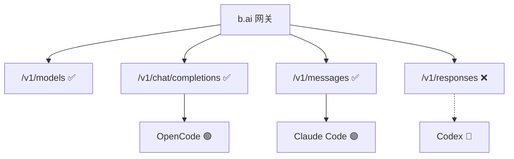

# 兼容性评估报告

本目录存放**具体站点 × Agent** 的测试结论与复现步骤（研究实证层）。  
研究总览与复现入口见根目录 [README.md](../../README.md)；文档导航见 [docs/README.md](../README.md)。  
E2E 全景见 [research/E2E原生兼容性全景.md](../research/E2E原生兼容性全景.md)。  
中转站技术栈见 [research/中转站主流技术栈调研.md](../research/中转站主流技术栈调研.md)。  
云上实验点：[experiment/EC2-用户侧隔离实验点设计.md](../experiment/EC2-用户侧隔离实验点设计.md)（Runner）、[experiment/EC2-中转站原型实验点设计.md](../experiment/EC2-中转站原型实验点设计.md)（原型）；实测结论仍写本目录。

## b.ai（2026-06-01）

Token 中转站 **b.ai** 上三种 Agent 同环境对比：

| 报告 | 结论 | 阻塞原因 |
|------|------|----------|
| [OpenCode](./OpenCode兼容性评估报告.md) | 🟢 兼容 | Chat Completions 对齐 |
| [Claude Code](./ClaudeCode兼容性评估报告.md) | 🟢 基本兼容 | Messages 对齐；部分模型需账户权限 |
| [Codex](./Codex兼容性评估报告.md) | 🔴 不兼容 | 缺 `/v1/responses` |

## 新增报告

完成 `./t_*` 探针后，在本目录新增 `站点-Agent兼容性评估报告.md`，并更新上表索引。
