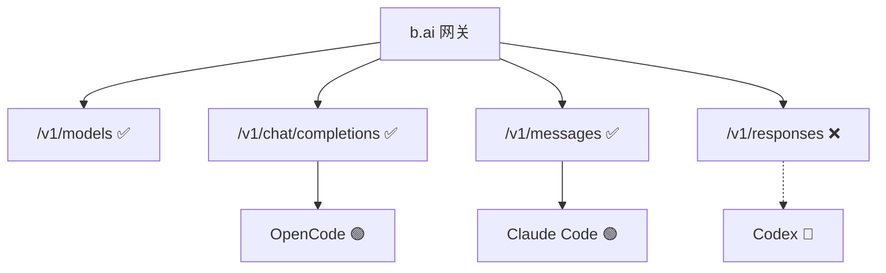

# 兼容性评估报告

本目录存放**具体站点 × Agent** 的测试结论与复现步骤。  
方法论与启动方式见仓库根目录 [README.md](../../README.md)。

## b.ai（2026-06-01）

Token 中转站 **b.ai** 上三种 Agent 同环境对比：

| 报告 | 结论 | 阻塞原因 |
|------|------|----------|
| [OpenCode](./OpenCode兼容性评估报告.md) | 🟢 兼容 | Chat Completions 对齐 |
| [Claude Code](./ClaudeCode兼容性评估报告.md) | 🟢 基本兼容 | Messages 对齐；部分模型需账户权限 |
| [Codex](./Codex兼容性评估报告.md) | 🔴 不兼容 | 缺 `/v1/responses` |

## 新增报告

完成 `./t_*` 探针后，在本目录新增 `站点-Agent兼容性评估报告.md`，并更新上表索引。
