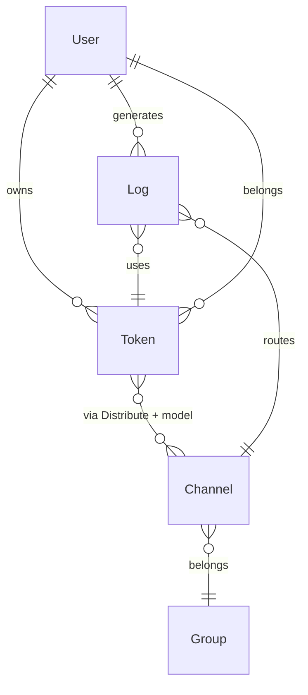
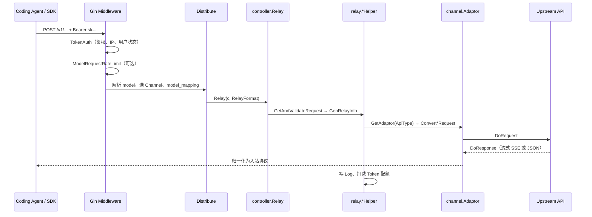

# New API 技术栈全景

> **文档类型**：技术栈参考 · **非** 兼容性认证报告 — 产品能力以 [官方文档](https://docs.newapi.pro/)（E1）为准；站点 × Agent 结论以 [reports/](../reports/) 实测（E3）为准。  
> **范围**：开源项目 [QuantumNous/new-api](https://github.com/QuantumNous/new-api)（One API 系活跃演进分支）的架构、模块、协议面与部署栈。  
> **与 [中转站主流技术栈调研](./中转站主流技术栈调研.md) 的关系**：该文横向对比 One API / New API / LiteLLM 等；**本文纵向展开 New API 单产品**，便于读源码与建站。  
> **与 [EC2-中转站原型实验点设计](../experiment/EC2-中转站原型实验点设计.md) 的关系**：实验点以 New API 为基线实现；Channel / Token / 三主端点配置见该稿 §6。

### 文档元信息

| 项 | 内容 |
|----|------|
| **编写日期** | 2026-06-03 |
| **源码基线** | `main` @ `b0ac042`（本地 `./scripts/pull-upstream.sh newapi` 拉取，不纳入 Git） |
| **发行镜像** | `calciumion/new-api:latest`（见仓库 `docker-compose.yml`） |
| **证据等级** | 下文标注 E0–E1；本仓库对**自托管 New API** 的 L3–L5 见 E4「待补」 |
| **复审触发** | New API 大版本、Relay 路由变更、`RelayFormat` 增删、Channel 类型变更、本仓库 `newapi-prototype` E3/E4 结论 |

---

## 目录

1. [定位与谱系](#1-定位与谱系)
2. [技术栈总览](#2-技术栈总览)
3. [仓库与分层架构](#3-仓库与分层架构)
4. [核心领域模型](#4-核心领域模型)
5. [Relay 转发流水线](#5-relay-转发流水线)
6. [RelayFormat 与对外 API 面](#6-relayformat-与对外-api-面)
7. [Channel 类型与 Adaptor](#7-channel-类型与-adaptor)
8. [协议转换与 Coding Agent](#8-协议转换与-coding-agent)
9. [计费、配额与观测](#9-计费配额与观测)
10. [管理台与前端](#10-管理台与前端)
11. [部署与运维](#11-部署与运维)
12. [许可证与合规](#12-许可证与合规)
13. [接入本仓库](#13-接入本仓库)
14. [局限与待验证项](#14-局限与待验证项)
15. [参考链接](#15-参考链接)

---

## 1. 定位与谱系

### 1.1 产品定义

**New API** 是面向 **多上游 LLM 聚合** 的自托管网关与管理台：对外暴露 OpenAI / Anthropic / Gemini 等标准 HTTP（及部分 WebSocket）接口，对内通过 **Channel（渠道）** 连接各厂商 API Key 或云凭证，并提供 **用户、Access Token、分组、倍率计费、日志与运营配置**。

| 维度 | 说明 |
|------|------|
| **算力** | 不自有模型；仅转发与协议适配 |
| **用户面** | 平台 **Access Token**（`sk-` 前缀惯例）调用 `/v1/*` |
| **运营面** | Web 管理台 + `/api/*` 管理接口 |
| **数据兼容** | 宣称与 **One API** 数据库结构兼容，便于从 One API 迁移（E1） |

### 1.2 与 One API 的关系

| 项目 | 仓库 | 许可证 | 适配器目录 | 协议分型 |
|------|------|--------|------------|----------|
| One API | [songquanpeng/one-api](https://github.com/songquanpeng/one-api) | MIT | `relay/adaptor` | 以 RelayMode 等为主 |
| **New API** | [QuantumNous/new-api](https://github.com/QuantumNous/new-api) | **AGPL-3.0** | `relay/channel` | 显式 **`types.RelayFormat`** |

中文 Token 二次分发社区常见 **One API → New API** fork 链；白标站 UI 相似 **不能** 推断协议面与上游版本一致（见 [中转站调研 §1.2](./中转站主流技术栈调研.md#12-术语表)）。

### 1.3 与本仓库实验点的关系

[EC2-中转站原型实验点](../experiment/EC2-中转站原型实验点设计.md) 在境外 EC2 部署 New API + MySQL（+ Redis），配置 Bedrock / OpenAI / Anthropic Channel，向 [用户侧 Runner](../experiment/EC2-用户侧隔离实验点设计.md) 交付 `base_url` + `NEWAPI_PROTOTYPE_TOKEN`。本文描述的是 **产品通用架构**；实验点 Channel 命名与 `model_mapping` 以实验稿为准。

---

## 2. 技术栈总览

| 层 | 技术 | 说明 |
|----|------|------|
| **语言 / 运行时** | Go 1.25+（`go.mod`） | 单进程 HTTP 服务，默认端口 **3000** |
| **Web 框架** | [Gin](https://github.com/gin-gonic/gin) | 路由、中间件、静态资源嵌入 |
| **ORM** | GORM v2 | **须同时支持** SQLite、MySQL ≥ 5.7.8、PostgreSQL ≥ 9.6 |
| **缓存** | Redis（go-redis）+ 内存缓存 | 渠道缓存、用户缓存、限流等；`REDIS_CONN_STRING` 未配时可降级 |
| **并发** | goroutine + [gopool](https://github.com/bytedance/gopkg) | 批量日志、异步任务 |
| **实时** | gorilla/websocket | OpenAI Realtime（`/v1/realtime`） |
| **前端（默认）** | React 19、TypeScript、Rsbuild、Tailwind、Base UI | `web/default/`，构建产物嵌入二进制 |
| **前端（经典）** | React 18、Vite、Semi Design | `web/classic/`，可选主题 |
| **包管理（前端）** | Bun（推荐） | `bun install` / `bun run build` |
| **国际化** | 后端 go-i18n；前端 i18next | 中/英等多语言 |
| **认证** | Session、JWT、WebAuthn、OAuth（GitHub / Discord / OIDC / Telegram 等） | 管理台登录；Relay 用 **Token** |
| **支付（可选）** | EPay、Stripe、Creem、Waffo 等 | 站内充值场景 |
| **容器** | Docker / Compose；镜像 `calciumion/new-api` | 生产建议 MySQL 或 PostgreSQL + Redis |

---

## 3. 仓库与分层架构

### 3.1 顶层目录（E1，拉取后对照）

```text
router/           HTTP 路由：/v1 relay、/api 管理、/mj、/suno、Dashboard
controller/       请求处理入口（Relay、用户、渠道、支付、OAuth…）
middleware/       TokenAuth、Distribute（选渠）、限流、CORS、统计
service/          业务逻辑（分组、渠道选择、计费等）
model/            GORM 实体：User、Token、Channel、Log、Task…
relay/            转发核心：helper、各 RelayFormat Handler、channel 适配器
  relay/channel/  厂商 Adaptor（openai、claude、aws、gemini…）
  relay/channel/task/  异步任务类（Suno、Kling、Sora…）
dto/              请求/响应结构体
types/            RelayFormat、统一错误类型
constant/         ChannelType、APIType、上下文 Key
setting/          倍率、模型、运营、性能等配置
common/           工具（含 JSON 封装、环境变量、Redis）
pkg/              内部包（如 billingexpr、perf_metrics、cachex）
web/              default / classic 两套前端
oauth/            OAuth 提供商注册
i18n/             后端翻译
main.go           启动、资源初始化、嵌入前端静态文件
```

项目内 **`CLAUDE.md` / `AGENTS.md`** 与上游 README 一致，强调分层：**Router → Controller → Service → Model**，Relay 路径在 Controller 调 `relay.*Helper`。

### 3.2 路由分组

| 前缀 | 用途 | 典型中间件 |
|------|------|------------|
| `/v1/*` | **Relay API**（OpenAI 兼容面 + Messages + Responses 等） | `TokenAuth` → `Distribute` |
| `/v1beta/*` | Gemini 原生路径 | 同上 |
| `/api/*` | 管理台 REST（用户、渠道、日志、支付） | `UserAuth` / `AdminAuth`、限流 |
| `/mj/*` | Midjourney Proxy 兼容 | `TokenAuth`、`Distribute` |
| `/suno/*` | Suno 任务 | `TokenAuth`、`Distribute` |
| `/pg/*` | Playground 聊天 | `UserAuth`、`Distribute` |
| 静态 | 嵌入的 `web/*/dist` | — |

Relay 路由注册见 `router/relay-router.go`（本仓库拉取源码中的路径）。

### 3.3 与 One API 源码阅读差异

| 概念 | One API | New API |
|------|---------|---------|
| 厂商适配包 | `relay/adaptor/<vendor>` | `relay/channel/<vendor>` |
| 入站协议枚举 | 分散在 RelayMode 等 | `types.RelayFormat` 字符串常量 |
| 适配器接口 | Adaptor（历史命名） | `channel.Adaptor` + `channel.TaskAdaptor` |

---

## 4. 核心领域模型

### 4.1 实体关系（概念）



### 4.2 User（用户）

- 角色：普通用户 / 管理员等（`common.IsValidateRole`）。
- 配额：`quota`、分组 `group`；可启用模型可见性、速率限制。
- 登录：Session Cookie；管理 API 可用 Access Token。

### 4.3 Token（Access Token）

用户调用 Relay 的凭据（`model/token.go`）：

| 字段 | 含义 |
|------|------|
| `key` | 平台 Token 字符串（唯一索引） |
| `remain_quota` / `unlimited_quota` | 剩余额度 / 是否无限 |
| `model_limits_enabled` + `model_limits` | 是否限制可调用的**对外模型名** |
| `group` | 使用的分组；影响可选 Channel 集合 |
| `allow_ips` | 可选 IP/CIDR 白名单 |
| `expired_time` | 过期时间（-1 表示永不过期） |
| `cross_group_retry` | 跨分组重试（auto 分组场景） |

**Token 后缀选渠（E1）**：Key 可带 `-{channelId}` 形式，由 `TokenAuth` 解析后写入 `ContextKeyTokenSpecificChannelId`，`Distribute` 强制使用该 Channel。

### 4.4 Channel（渠道）

指向上游的一条连接（`model/channel.go`）：

| 字段 | 含义 |
|------|------|
| `type` | `ChannelType*` 整型（OpenAI、Anthropic、Aws、Gemini…） |
| `key` | 上游 API Key（或多 Key 模式） |
| `base_url` | 自定义上游 Base URL |
| `models` | 渠道支持的模型列表（逗号分隔等） |
| `group` | 渠道所属分组 |
| `weight` / `priority` | 负载均衡权重与优先级 |
| `model_mapping` | JSON：**对外 model → 上游 model** |
| `status_code_mapping` | 上游状态码映射 |
| `param_override` / `header_override` | 请求参数/头覆盖 |
| `channel_info` | 多 Key 轮询、禁用原因等 |

### 4.5 日志与任务

- **Log**：每次 Relay 的 Token 用量、倍率、渠道、错误等，供控制台与对账。
- **Task**：Midjourney、Suno、视频生成等 **异步任务** 渠道，走 `TaskAdaptor` 与轮询结算（`relay/channel/task/*`）。

---

## 5. Relay 转发流水线

### 5.1 序列（HTTP Chat / Messages / Responses）



### 5.2 中间件职责

| 中间件 | 作用 |
|--------|------|
| `TokenAuth` | 校验平台 Token；兼容 Anthropic `x-api-key`、Gemini `?key=` / `x-goog-api-key`、Realtime WebSocket 协议头中的 Key |
| `Distribute` | 解析 body 中 `model`；按分组 + 权重/优先级选 Channel；校验 Token 模型白名单 |
| `ModelRequestRateLimit` | 用户级模型限速 |
| `StatsMiddleware` | 请求统计 |

### 5.3 Controller 内部分发

`controller.Relay` 根据 `RelayFormat` 生成 `RelayInfo`，再进入：

| RelayMode（节选） | Helper |
|-------------------|--------|
| 文本 Chat / Claude | `relay.TextHelper` |
| Responses | `relay.ResponsesHelper` |
| Embedding / Rerank / Image / Audio | 对应 `*Helper` |
| Gemini 路径 | `relay.GeminiHelper` |
| Realtime | WebSocket + `relay` WS 逻辑 |

失败时按 `RelayFormat` 返回 OpenAI 或 Claude 错误 JSON 形状。

### 5.4 Adaptor 契约

`relay/channel/adapter.go` 定义 `Adaptor` 接口，核心方法：

- `Init` / `GetRequestURL` / `SetupRequestHeader`
- `ConvertOpenAIRequest`、`ConvertClaudeRequest`、`ConvertGeminiRequest`、`ConvertOpenAIResponsesRequest` 等
- `DoRequest` / `DoResponse`（含流式）
- `GetModelList`

**TaskAdaptor** 另管异步任务的预扣费、提交、轮询与完成后结算。

---

## 6. RelayFormat 与对外 API 面

定义于 `types/relay_format.go`：

| RelayFormat | 常量值 | 主要 HTTP 路径 | 备注 |
|-------------|--------|----------------|------|
| OpenAI Chat | `openai` | `POST /v1/chat/completions`、`/v1/completions` | OpenCode 主路径 |
| Claude | `claude` | `POST /v1/messages` | Claude Code；需 `anthropic-version` |
| OpenAI Responses | `openai_responses` | `POST /v1/responses` | Codex ≥ 0.133 |
| Responses 压缩 | `openai_responses_compaction` | `POST /v1/responses/compact` | — |
| OpenAI Realtime | `openai_realtime` | `GET /v1/realtime`（WS） | 可选 |
| Gemini | `gemini` | `/v1beta/models/*`、`POST /v1/models/*path` | Gemini CLI 生态 |
| Embedding | `embedding` | `POST /v1/embeddings` | — |
| Rerank | `rerank` | `POST /v1/rerank` | Cohere / Jina |
| Image / Audio | `openai_image` / `openai_audio` | `/v1/images/*`、`/v1/audio/*` | — |
| 任务 | `task` / `mj_proxy` | `/suno/*`、`/mj/*` | 非三 Agent 主场景 |

**模型列表**：`GET /v1/models`（按请求头区分 OpenAI / Anthropic / Gemini 列表逻辑）。

> **部署 ≠ 源码全集**：路由在源码中注册 **不代表** 运营方对外暴露。商业站可能在前置代理裁剪路径（如 b.ai 对 `/v1/responses` 返回 403，见 [中转站调研 §2.2](./中转站主流技术栈调研.md#22-探测结果解读l2)）。

---

## 7. Channel 类型与 Adaptor

### 7.1 ChannelType（节选）

`constant/channel.go` 定义 **50+** 渠道类型枚举，例如：

| 类型 ID | 名称 | 默认 Base URL（节选） |
|---------|------|------------------------|
| 1 | OpenAI | `https://api.openai.com` |
| 14 | Anthropic | `https://api.anthropic.com` |
| 33 | Aws | （Bedrock 等，依配置） |
| 24 | Gemini | Google Generative Language |
| 3 | Azure | 自定义 |
| 57 | Codex | `https://chatgpt.com` |
| 36 | SunoAPI | 任务类 |
| 2 / 5 | Midjourney / MJ Plus | 绘图代理 |

完整列表以拉取后的 `constant/channel.go` 为准。

### 7.2 APIType → Adaptor 映射

`relay/relay_adaptor.go` 中 `GetAdaptor(apiType)` 将逻辑 API 类型映射到实现包，例如：

- `APITypeOpenAI` / `OpenRouter` / `Xinference` → `openai.Adaptor`
- `APITypeAnthropic` → `claude.Adaptor`
- `APITypeAws` → `aws.Adaptor`（含 Bedrock 运行时依赖）
- `APITypeGemini` → `gemini.Adaptor`
- `APITypeCodex` → `codex.Adaptor`
- `APITypeMoonshot` → `moonshot.Adaptor`（注释：走 Claude API 形状）

`relay/channel/` 下约 **40** 个厂商包 + `task/` 子目录。

### 7.3 渠道选择算法（E1）

`middleware.Distribute` 在 Token 未指定 Channel 时：

1. 读取请求 JSON 的 `model`（及 Playground 的 `group`）。
2. 在用户 `group` 下按 **模型名匹配** 过滤可用 Channel。
3. 按 **priority**、**weight** 随机或轮询选择；失败可 **同请求切换渠道重试**（次数可配置）。
4. 应用 `model_mapping` 得到上游模型 ID。

---

## 8. 协议转换与 Coding Agent

### 8.1 本仓库三 Agent 与端点

| Agent | 主 Wire | New API 路由 | `sites.json` 字段 |
|-------|---------|--------------|-------------------|
| OpenCode | Chat Completions | `POST /v1/chat/completions` | `base_url` → `.../v1` |
| Claude Code | Anthropic Messages | `POST /v1/messages` | `anthropic_base_url`（根域，无 `/v1` 后缀） |
| Codex | OpenAI Responses | `POST /v1/responses` | `base_url` |

L2 探测：`./scripts/probe-endpoints.sh <site>`（见 [中转站调研 §2.1](./中转站主流技术栈调研.md#21-本仓库-l2-探测方法)）。

### 8.2 官方宣称的格式转换（E1）

README 列出的能力（**实现程度以版本为准**）：

| 转换 | 状态（README） |
|------|----------------|
| OpenAI Compatible ⇄ Claude Messages | ✅ |
| OpenAI Compatible → Gemini | ✅ |
| Gemini → OpenAI Compatible | 部分（文本为主） |
| OpenAI Compatible ⇄ OpenAI Responses | 🚧 开发中 |
| Thinking → content 等 | ✅（模型名后缀策略） |

因此：**自托管 New API 虽注册 `/v1/responses`，能否端到端跑通 Codex 仍须 E3/E4**（含渠道类型、上游是否真支持 Responses）。若仅 Chat 可用，可参考 [编程 Agent 协议转换调研](./编程Agent模型转换插件调研.md) 中的 **codex-bridge** 路径。

### 8.3 TokenAuth 与 Agent 客户端习惯

- Claude Code 常只带 `x-api-key`：`TokenAuth` 会将其转为 `Authorization: Bearer`。
- Codex Realtime 可能通过 `Sec-WebSocket-Protocol` 携带 Key，中间件会抽取并规范化。

---

## 9. 计费、配额与观测

### 9.1 配额模型

- **用户配额** + **Token 剩余额度**；请求前 **预扣（pre-consume）**，完成后按实际 Token 结算。
- **倍率**：`setting/ratio_setting` 管理模型倍率、分组倍率、缓存命中计费等。
- **表达式计费**：复杂阶梯价格见 `pkg/billingexpr/`（修改前须读 `expr.md`）。

### 9.2 支付与充值（可选）

管理台支持多种支付回调（Stripe、EPay、Creem、Waffo 等），用于 **站内充值** 场景，与「上游厂商 Billing」分离。

### 9.3 观测

- 请求日志、渠道测试、控制台 Dashboard。
- 可选 **Pyroscope** 性能剖析（环境变量 `PYROSCOPE_*`）。
- `pkg/perf_metrics` 与 `/api/perf-metrics` 供运营分析。

---

## 10. 管理台与前端

| 主题 | 路径 | 技术 |
|------|------|------|
| **Default** | `web/default/` | React 19、Rsbuild、Tailwind、Base UI |
| **Classic** | `web/classic/` | React 18、Vite、Semi Design |

生产二进制默认 **embed** `web/default/dist`（`main.go` 中 `//go:embed`）。本地开发：`cd web/default && bun run dev`。

管理功能包括：渠道 CRUD、模型倍率、用户/Token、日志查询、2FA、Passkey、OAuth 登录、公告与定价页等（`/api/*`）。

---

## 11. 部署与运维

### 11.1 推荐拓扑（生产）

```text
                    ┌─────────────┐
  User Runner ─────►│  Nginx/TLS  │────► new-api:3000
                    └─────────────┘           │
                                                ├──► PostgreSQL / MySQL
                                                └──► Redis
```

### 11.2 Docker Compose（E1）

仓库 `docker-compose.yml` 默认：**new-api + postgres + redis**。关键环境变量：

| 变量 | 说明 |
|------|------|
| `SQL_DSN` | 数据库连接串（或用 SQLite 卷 `/data`） |
| `REDIS_CONN_STRING` | Redis（建议生产启用） |
| `SESSION_SECRET` | 多实例部署 **必改** |
| `STREAMING_TIMEOUT` | 流式无响应超时（秒），默认 120 |
| `MAX_REQUEST_BODY_MB` | 解压后请求体上限 |
| `NODE_NAME` | 多节点审计标识 |
| `BATCH_UPDATE_ENABLED` | 批量写库优化 |

### 11.3 健康检查

Compose 内建：`GET /api/status` 检查 `success: true`。

### 11.4 与本仓库原型实验点对齐

实验点建议：`t3.large`、40GiB 盘、MySQL、**不对公网开放 3000**（仅对用户侧 Runner SG 放行）。出站应仅含上游 API 与 DB/Redis（见 [EC2-中转站原型 §7](../experiment/EC2-中转站原型实验点设计.md#7-出站审计中转站侧)）。

---

## 12. 许可证与合规

| 项 | 内容 |
|----|------|
| **许可证** | **GNU AGPL-3.0**（`LICENSE`） |
| **对用户的影响** | 内部原型 / 私有 VPC 通常可接受；**对外提供 SaaS 或转售** 需法务评估 AGPL 源码公开义务 |
| **上游** | 用户须合法取得各厂商 API 权限；README 强调合规备案与安全义务 |
| **品牌** | 上游仓库对项目名/组织信息有保护策略（见 `CLAUDE.md` Rule 5） |

One API 为 **MIT**，若仅参考架构而不可接受 AGPL，需另选 fork 或 LiteLLM（见 [中转站调研 §6](./中转站主流技术栈调研.md#6-litellmpython--fastapi)）。

---

## 13. 接入本仓库

### 13.1 拉取参考源码

```bash
./scripts/pull-upstream.sh newapi   # → newapi/（.gitignore）
```

**不要**让 `t_*` 启动器依赖 `newapi/` 目录；启动器只读 `sites.json` + `.env`。

### 13.2 登记站点（原型示例）

维护者在 `sites.json` 增加 `newapi-prototype`（host 按实际修改），`.env` 配置 `NEWAPI_PROTOTYPE_TOKEN`。模板见 [EC2-中转站原型 §9](../experiment/EC2-中转站原型实验点设计.md#9-交付用户侧sitesjson)。

### 13.3 评估流程

1. 运营商侧：Channel 通、发 Token  
2. 用户侧：`./scripts/run-user-side-compat.sh --site newapi-prototype` 或 `probe-endpoints` + `./t_* -y`  
3. 结论写入 `docs/reports/`，scope 标注 **经 newapi-prototype**

### 13.4 相关脚本

| 脚本 | 用途 |
|------|------|
| `scripts/probe-endpoints.sh` | L2 四端点探测 |
| `scripts/run-user-side-compat.sh` | 用户侧 Runner 一键 probe + 可选 smoke |
| `scripts/poc-litellm-bai-codex.sh` | LiteLLM POC（非 New API） |

---

## 14. 局限与待验证项

| 局限 | 说明 |
|------|------|
| **E4 未覆盖** | 本仓库尚无自托管 New API 的完整 L3–L5 报告；E1 不能替代 `t_*` 实测 |
| **版本漂移** | 商业 Token 站、白标 fork 可能与 `main` 不一致 |
| **Responses 转换** | README 标注 OpenAI ↔ Responses 仍开发中；Codex 直连需单独验证 |
| **文档与代码** | 本文基于拉取日 `main`；发行 tag 与 Docker `latest` 可能略有差异 |
| **grep 索引** | `newapi/` 在 `.gitignore`，IDE 全局搜索可能跳过，请用 `pull-upstream.sh` 后本地阅读 |

**建议下一步**：按 [EC2-中转站原型](../experiment/EC2-中转站原型实验点设计.md) 完成阶段 0–3 后，在 reports 新增 `newapi-prototype × Agent` 卷，并回写 [中转站调研](./中转站主流技术栈调研.md) 的 E3/E4 表。

---

## 15. 参考链接

| 资源 | URL |
|------|-----|
| 源码 | https://github.com/QuantumNous/new-api |
| 官方文档 | https://docs.newapi.pro/ |
| Relay / API | https://docs.newapi.pro/en/docs/api |
| 部署 | https://docs.newapi.pro/en/docs/installation |
| 环境变量 | https://docs.newapi.pro/en/docs/installation/config-maintenance/environment-variables |
| Docker Hub | https://hub.docker.com/r/calciumion/new-api |
| One API（上游） | https://github.com/songquanpeng/one-api |
| 本仓库中转站横向调研 | [中转站主流技术栈调研.md](./中转站主流技术栈调研.md) |
| 本仓库协议桥接地图 | [编程Agent模型转换插件调研.md](./编程Agent模型转换插件调研.md) |
| 本仓库原型实验点 | [EC2-中转站原型实验点设计.md](../experiment/EC2-中转站原型实验点设计.md) |

---

**摘要**：New API 是 **Go/Gin + GORM** 的多租户 LLM 网关，以 **`RelayFormat` + `relay/channel` Adaptor** 统一 Chat、Messages、Responses、Gemini、Realtime 等入站形态，以 **Channel + Token + 分组倍率** 完成路由与计费。读源码时抓住 **`router/relay-router.go` → `controller.Relay` → `middleware.Distribute` → `GetAdaptor`** 四条线；接入本仓库时先用 **`probe-endpoints`** 确认三主端点，再跑 **`t_*`** 写报告。
