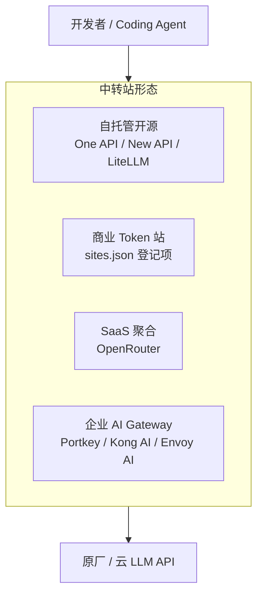
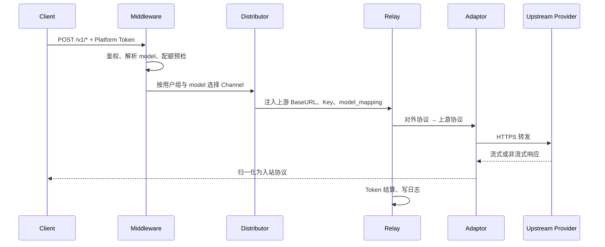
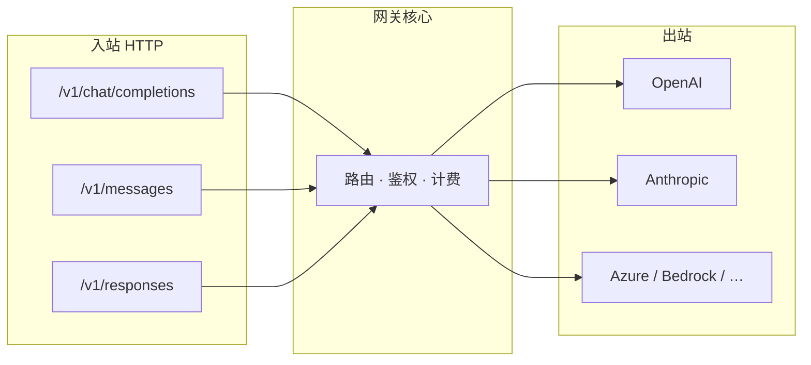

# Token 中转站主流技术栈调研

> **文档类型**：技术栈参考 · **非** 兼容性认证报告 — 产品能力以官方文档（E0/E1）为准；站点 × Agent 结论以 [reports/](../reports/) 实测（E3）为准。  
> **范围**：LLM Token 聚合、二次分发、统一 API 网关类「中转站」及其自托管实现。  
> **与 [E2E 原生兼容性全景](./E2E原生兼容性全景.md) 的关系**：全景矩阵不含中转站；本文说明中转站 **实现栈与对外协议面**，供选型与 L2 探测。  
> **与 [编程 Agent 协议转换与网关调研](./编程Agent模型转换插件调研.md) 的关系**：该文描述 **Agent 侧桥接**；本文描述 **网关产品如何实现聚合与转发**。

### 文档元信息

| 项 | 内容 |
|----|------|
| **编写日期** | 2026-06-03 |
| **修订日期** | 2026-06-03（v2：证据等级、术语表、探测解读、局限声明） |
| **调研基线** | New API `v1.0.0-rc.9`（2026-05-26）· One API `main` 活跃分支 · LiteLLM Docker `-stable` 线 · 本仓库 E3 首批（2026-06-01，站点见 [reports](../reports/README.md)） |
| **复审触发** | 主流网关大版本变更、新增或废弃 `/v1/responses` / Realtime 等端点、本仓库新增站点 E3 报告 |
| **待补实测** | 自托管 New API × 三 Agent 的 L3–L5（当前 E3 完整批次仅首批登记站点）；境外原型见 [EC2-中转站原型实验点设计.md](../experiment/EC2-中转站原型实验点设计.md)，用户侧 Runner 见 [EC2-用户侧隔离实验点设计.md](../experiment/EC2-用户侧隔离实验点设计.md) |

---

## 目录

1. [问题定义与术语](#1-问题定义与术语)
2. [证据等级与调研方法](#2-证据等级与调研方法)
3. [形态分类](#3-形态分类)
4. [技术栈总览](#4-技术栈总览)
5. [One API 系（Go / Gin）](#5-one-api-系go--gin)
6. [LiteLLM（Python / FastAPI）](#6-litellmpython--fastapi)
7. [SaaS 与商业 Token 站](#7-saas-与商业-token-站)
8. [企业级 AI Gateway](#8-企业级-ai-gateway)
9. [共性架构模式](#9-共性架构模式)
10. [协议面与 Coding Agent](#10-协议面与-coding-agent)
11. [部署与运维](#11-部署与运维)
12. [选型建议](#12-选型建议)
13. [接入本仓库](#13-接入本仓库)
14. [风险、局限与验证](#14-风险局限与验证)
15. [参考链接](#15-参考链接)

---

## 1. 问题定义与术语

### 1.1 中转站的定义

在本仓库语境下，**Token 中转站** 指介于终端用户与 **原厂 / 云厂商 LLM API** 之间的聚合服务，通常提供：

| 能力 | 说明 |
|------|------|
| **统一入口** | 对外暴露 OpenAI Chat、Anthropic Messages 等标准 HTTP 端点 |
| **Key 二次分发** | 平台聚合上游 Key，用户持有平台级 Access Token |
| **模型映射** | 将对外 `model` 字段路由至渠道（Channel）上的实际上游模型 ID |
| **计费与配额** | 预扣费、按 Token 结算、用户余额、渠道权重与优先级 |
| **协议裁剪或扩展** | 常仅开放部分端点；亦可能扩展 Midjourney、Suno、Rerank 等非 Chat 能力 |

与 **原厂 API** 的差异：中转站 **不拥有模型算力**，价值在于 **聚合、定价与可用性**；对外协议面 **可能不完整**（参见 [reports/](../reports/) 各站点 × Agent 评估）。

### 1.2 术语表

| 术语 | One API / New API | LiteLLM | 含义 |
|------|-------------------|---------|------|
| **Channel / 渠道** | Channel | Deployment | 指向上游厂商的一条连接（Base URL + Key + 类型） |
| **Token / 访问令牌** | Access Token | Virtual Key | 用户调用中转站 API 的 Bearer Key |
| **Relay / 转发** | `controller.Relay` | `proxy_server` → SDK | 鉴权、选渠、转换、回写响应的核心路径 |
| **Adaptor / 适配器** | `relay/adaptor` 或 `relay/channel` | Provider 模块 | 请求/响应在「对外协议」与「上游协议」间转换 |
| **RelayFormat** | New API `types.RelayFormat` | — | 入站协议类型（Chat、Messages、Responses 等） |
| **model_mapping** | Channel 配置字段 | Router `model_name` | 对外模型 ID → 上游模型 ID |

### 1.3 与「协议转换 / 网关插件」的边界

```text
中转站（本文）   = 平台级网关：渠道、计费、多租户、对外 API 面
Agent 侧桥接（另文） = 客户端与上游之间的协议适配：Responses↔Chat、Messages↔Chat
```

二者可叠加：例如 Codex 经 **codex-bridge** 访问 **仅暴露 Chat 的中转站**；LiteLLM 亦可同时承担网关与部分协议转换。

### 1.4 调研范围

| 纳入 | 不纳入 |
|------|--------|
| One API、New API 及 Go 系 fork | 纯本地推理（Ollama、vLLM）— 属上游，非中转 |
| LiteLLM Proxy（AI Gateway） | Agent 内置 MCP / 插件市场（见协议转换调研 §1.2） |
| OpenRouter、Portkey 等 SaaS / 企业网关 | Gemini CLI 专用 `generateContent` 生态 |
| 商业 Token 站（`sites.json` 登记；**须逐站 probe**） | 各站定价、合规条款、服务等级协议 |

---

## 2. 证据等级与调研方法

与 [协议转换调研 §1.4](./编程Agent模型转换插件调研.md#14-证据等级) 共用同一套等级，便于跨文档引用：

| 等级 | 含义 | 本文典型来源 |
|------|------|--------------|
| **E0** | 原厂 / 云厂商官方文档 | OpenAI Responses、Anthropic Messages 规范 |
| **E1** | 网关项目 README、官方文档、发行说明 | New API Relay 文档、LiteLLM Proxy 文档 |
| **E2** | 社区讨论、架构分析、未在本仓库复现的第三方测评 | OpenRouter 路由说明、DeepWiki 架构摘要 |
| **E3** | **本仓库** Layer 1–2 评估 + `reports/` 实测 | 登记站点 × Agent（见 [reports 索引](../reports/README.md)） |
| **E4** | **本仓库** 转换层 × Agent 的 L3–L5 | LiteLLM × Codex（首批站点 `b.ai`） |

**阅读原则**：表格中的「产品级支持」多来自 E0–E1；**具体 Token 站能否用于某 Agent** 必须 E3（至少 L2 probe），生产环境另需 L3–L5。

### 2.1 本仓库 Layer 1–2 探测方法

```bash
cd experiment/user-side
./scripts/assess-platform.sh --site <site>    # Layer 1: catalog 分支
./scripts/assess-protocol.sh --site <site>    # Layer 2: protocol 内 model × wire
```

实现位于 `experiment/user-side/lib/maas.py`（`assess-platform` / `assess-protocol`）：**直打上游源**，不经 LiteLLM。第 2 层 scope 由 **`sites.json` 的 `protocol`** 决定（`anthropic` / `openai` / `chat`）；探测目标见 **`assess-plan.json` → `layer2`**。

| 探测 | HTTP 方法 | 路径 | 映射 Agent |
|------|-----------|------|------------|
| 模型列表 | GET | `/v1/models` | Layer 1（catalog 分支） |
| Chat | POST | `/v1/chat/completions` | OpenCode |
| Messages | POST | `/v1/messages`（含 `anthropic-version`） | Claude Code |
| Responses | POST | `/v1/responses` | Codex |

Layer 3（`run-source-agent-test.sh`）经 LiteLLM；与 Layer 2 勿混列。

### 2.2 探测结果解读（L2）

脚本将状态码归类为 `OK`（200）或 `HTTP xxx`。**仅 200 计为 L2 通过**；以下常见情况需区分：

| 结果 | 常见含义 | 处理建议 |
|------|----------|----------|
| **200** | 端点存在且 Key/模型组合可用 | 继续 L3–L5（`./experiment/user-side/t_*`） |
| **401 / 403** | 端点可能存在，但 Key、模型权限或路径策略拒绝 | 换模型、充值或查站方文档；**不能**等同于 404「不存在」 |
| **404** | 路径未暴露或路由未注册 | 该 Agent 主 wire **不可用**（除非前置桥接） |
| **502 / 504** | 上游或渠道故障 | 渠道健康、超时配置问题 |

**E3 样例（路径白名单型 403）**：部分商业 Token 站对 `/v1/responses` 返回 **403** 且 body 明确列出允许路径 — 属于 **策略性裁剪**，而非临时故障（首批实测站点见 [Codex 报告](../reports/Codex兼容性评估报告.md) §4）：

```json
{
  "message": "HTTP node only allows access to inference API paths (/v1/chat/completions, /v1/messages, /v1/models)",
  "success": false
}
```

---

## 3. 形态分类



| 形态 | 典型产品 | 源码与部署 | 主要用户 | 证据 |
|------|----------|------------|----------|------|
| **自托管开源** | One API、New API、LiteLLM | Docker / 二进制 / Helm | 个人、小团队、二次开发 | E1 |
| **商业 Token 站** | 各 `sites.json` 登记 SaaS | 闭源 SaaS | 按量购 Token 的开发者 | E3（按站点报告） |
| **SaaS 聚合** | OpenRouter | 闭源 API | 多模型试用、BYOK、智能路由 | E1–E2 |
| **企业网关** | Portkey、LiteLLM Enterprise、Kong AI | 托管或私有化 | 审计、SLA、策略与可观测 | E1 |

---

## 4. 技术栈总览

下表描述 **产品官方技术栈（E1）**。商业 Token 站若未公开实现，不得从 UI 相似性反推。

| 产品线 | 语言 / 框架 | 管理前端 | 持久化 | 缓存 / 异步 | 协议适配层 |
|--------|-------------|----------|--------|-------------|------------|
| **One API** | Go · Gin | React · Vite · Semi Design | SQLite / MySQL / PG · GORM | Redis（可选） | `relay/` + `relay/adaptor/*` |
| **New API** | Go · Gin（One API 演进） | React · Vite · Semi · Bun | 同上 | Redis · 进程内缓存 | `relay/channel/*` · `RelayFormat` |
| **LiteLLM Proxy** | Python · FastAPI · Uvicorn | 内置 Admin UI | PostgreSQL · Prisma | Redis · DualCache · RQ/Celery | `litellm/` SDK + Router |
| **OpenRouter** | **闭源**（公开材料未披露实现语言） | Web 控制台 | 云端计费账本 | 据第三方架构分析：Redis、熔断、缓存（E2） | OpenAI Chat 归一化 + Provider 路由 |
| **Portkey** | 闭源（支持 SaaS / 私有部署） | Dashboard | 云端或客户环境 | 未公开 | Responses / Messages / Chat（E1，需查当前文档） |
| **商业 Token 站** | 未知（常见为 New API fork 或自研） | 各站定制 | — | — | **必须 E3 探测** |

**生态观察（E2）**：中文 Token 二次分发社区大量基于 **One API → New API** fork 链；英文团队统一网关场景更常见 **LiteLLM** 或 **Portkey**。该观察 **不能** 替代单站 probe。

---

## 5. One API 系（Go / Gin）

### 5.1 谱系与定位

| 项目 | 关系 | 说明 | 证据 |
|------|------|------|------|
| [One API](https://github.com/songquanpeng/one-api) | 源头 | LLM API 管理与 Key 分发；单二进制 + Docker | E1 |
| [New API](https://github.com/QuantumNous/new-api) | 活跃演进分支 | 多 `RelayFormat`、扩展渠道、Responses / Realtime 等 | E1 |
| 私有部署 / 白标站 | Fork 或深度定制 | 可能与上游 **版本漂移**；UI 相似 ≠ 协议面一致 | E2 |

本仓库可通过 `./upstream/pull.sh newapi` 拉取 New API 参考源码到 `upstream/newapi/`（gitignored，不纳入版本库）。

### 5.2 技术栈对比（One API vs New API）

| 层 | One API | New API |
|----|---------|---------|
| HTTP | Gin · 中间件（鉴权、限流、分发） | 同上 + 扩展 Relay 路由 |
| ORM | GORM v2 | GORM v2 |
| 数据库 | SQLite / MySQL / PostgreSQL | 同上 |
| 缓存 | Redis（可选） | Redis + 内存缓存 |
| 认证 | Session / Token / OAuth（视版本） | JWT · WebAuthn · 多 OAuth 提供商 |
| 前端 | React · Vite · Semi Design | React 18 · Bun 构建 |
| 并发 | Go goroutine | goroutine · gopool |
| 实时 | 视渠道 | gorilla/websocket（OpenAI Realtime 等） |

### 5.3 New API 代码结构（E1）

```text
router/           HTTP 路由（/v1/*、Dashboard）
controller/       请求入口（含 Relay）
middleware/       TokenAuth、渠道分发、限流、统计
relay/
  relay/channel/  厂商适配（openai、claude、gemini、aws…）
  relay/common/   GenRelayInfo、流式与错误处理
model/            用户、渠道、Token、账单（GORM）
service/          业务逻辑
setting/          倍率、模型与运营配置
dto/ · types/     RelayFormat、请求响应 DTO
web/              React 管理台
```

One API 沿用 **`relay/adaptor`** 命名；New API 重构为 **`relay/channel`** 并引入显式 **`RelayFormat`** — 阅读 fork 源码时需核对目录，不可混称。

### 5.4 请求流水线

One API / New API 共用 **Channel + Adaptor** 模型：



| 阶段 | 行为 |
|------|------|
| **渠道选择** | 权重 / 优先级负载均衡；或 Token 后缀指定渠道 `KEY-CHANNEL_ID`（One API 文档，E1） |
| **模型映射** | Channel 级 `model_mapping` |
| **失败重试** | 同请求切换渠道重试（次数可配置） |
| **流式** | SSE 透传或分块转换；须正确处理 `[DONE]` 与 idle |

### 5.5 对外协议面（New API 文档，E1）

| RelayFormat | 端点 | Coding Agent 关联 | 备注 |
|-------------|------|-------------------|------|
| OpenAI Chat | `POST /v1/chat/completions` | OpenCode | 最常见 |
| Anthropic Messages | `POST /v1/messages` | Claude Code | 需 `anthropic-version` |
| OpenAI Responses | `POST /v1/responses` | Codex | **代码存在 ≠ 部署暴露** |
| Models | `GET /v1/models` | 模型发现 | Claude Code 可选 Gateway 发现 |
| Gemini | `/v1beta/models/*` | Gemini CLI | 非本仓库三 Agent 主路径 |
| Realtime | WebSocket | Codex（可选 WS） | 多数中转站未启用 |
| 扩展任务 | Midjourney、Suno、Rerank、Dify 等 | — | 非 Coding Agent 主场景 |

> **重要**：New API **源码支持** Responses 路由（E1），但具体 Token 站是否对外暴露，取决于 **部署版本、渠道类型、管理员开关与上游能力**。不得因「疑似 New API 皮肤」推断 Codex 可用。

---

## 6. LiteLLM（Python / FastAPI）

### 6.1 产品组成

| 组件 | 用途 | 中转站语境 |
|------|------|------------|
| **Python SDK** | 代码内 `completion()` 统一调用 100+ 厂商 | 嵌入业务，非完整多租户 UI |
| **AI Gateway（Proxy）** | 中心化 HTTP 服务 | Virtual Key、预算、路由、观测 |

### 6.2 技术栈（E1）

| 层 | 技术 |
|----|------|
| HTTP | FastAPI · Uvicorn / Gunicorn |
| SDK | `litellm/main.py` · httpx 客户端 |
| 路由 | `router.py` · `router_strategy/*` |
| 持久化 | PostgreSQL · Prisma |
| 缓存 | Redis · DualCache · InternalUsageCache |
| 异步 | RQ / Celery / APScheduler |
| 观测 | Hooks；Langfuse / MLflow 等集成 |
| 部署 | Docker（`-stable` 标签）；Helm |

### 6.3 请求路径

```text
Client → proxy_server.py（FastAPI）
         → Auth / Rate Limit / Budget
         → Router（deployment 选择、fallback）
         → litellm SDK → Upstream
         → Cost Tracking → PostgreSQL
```

### 6.4 与 One API 系的差异

| 维度 | LiteLLM | One API / New API |
|------|---------|-------------------|
| 运行时 | Python | Go |
| 管理台 | 内置 Admin（英文为主） | Semi Design（中文社区友好） |
| 厂商覆盖 | SDK 层声明 100+（E1） | 渠道插件 + 社区维护 |
| Anthropic 入站 | `/v1/messages`（E1） | 原生 Messages 路由 |
| Responses 入站 | `/v1/responses`（E1；tool 映射需 E4） | New API `RelayFormat` |
| 典型场景 | 平台 / MLOps / 多云统一 | 中文 Token 分发与二次售卖 |
| 许可证 | MIT（核心） | One API MIT；New API **AGPL-3.0** |

---

## 7. SaaS 与商业 Token 站

### 7.1 OpenRouter

| 项 | 内容 | 证据 |
|----|------|------|
| API 入口 | `https://openrouter.ai/api/v1/chat/completions`（OpenAI 兼容） | E1 |
| 能力 | 多 Provider 聚合、价格/延迟/吞吐量排序、fallback | E1 |
| 计费 | 平台 Credit；支持 BYOK | E1 |
| 实现 | **闭源**；公开文档描述路由与 metadata，未披露后端语言 | E1 |
| Coding Agent（L2 推断） | OpenCode：Chat 直连可行；Claude Code / Codex：缺原生 Messages / Responses 入站，需额外网关或桥接 | E1 + 本仓库 wire 定义（E0） |

路由可通过请求体 `provider` 对象配置 `order`、`sort`、`allow_fallbacks` 等（E1）。

### 7.2 商业 Token 站（E3 接入约定）

商业站 **实现栈通常不公开**；运维上可能基于 New API fork 或完全自研 — **协议面仅以 probe 与 reports 为准**，不得以 UI 相似性推断端点集合。

`experiment/user-side/sites.json` 登记约定（字段含义对所有站点相同）：

| 字段 | 含义 | 用途 |
|------|------|------|
| `base_url` | OpenAI 兼容根（含 `/v1`） | OpenCode / Codex probe、`openai_base_url` |
| `anthropic_base_url` | Anthropic 兼容根 | Claude Code（Messages 位于 `/v1/messages`） |
| `api_key_env` | `.env` 中 Key 变量名 | 启动器与 probe |

**首批 E3 完整三 Agent 对比**（站点 ID `b.ai`）探测摘要 — **不可外推至其他站**：

| 探测项 | 结果 |
|--------|------|
| `GET /v1/models` | 通过 |
| `POST /v1/chat/completions` | 通过 → OpenCode 兼容 |
| `POST /v1/messages` | 通过（部分模型受账户权限限制） → Claude Code 基本兼容 |
| `POST /v1/responses` | **拒绝**（403，路径白名单） → Codex 不兼容 |

详情见 [reports 索引](../reports/README.md#e3站点--agent-直连2026-06-01)。

### 7.3 白标站识别（E2 经验，非判定标准）

| 信号 | 说明 |
|------|------|
| UI 与 New API 管理台高度相似 | 可能为 fork，**不能**证明端点集合一致 |
| 错误 JSON 字段风格 | 可作线索，非充分条件 |
| **`assess-protocol` 结果（protocol scope 内）** | **唯一** 可纳入本仓库结论的 Layer 2 依据 |

---

## 8. 企业级 AI Gateway

面向 **策略、合规、可观测**，常与低价 Token 站 **互补**（亦可私有化替代 LiteLLM）：

| 产品 | 侧重点 | Coding Agent | 证据 |
|------|--------|--------------|------|
| [Portkey](https://portkey.ai/) | 路由、缓存、Guardrail、统一观测 | 文档声明多协议面；须查当前版本 | E1 |
| [Helicone](https://helicone.ai/) | 代理与日志 | 不改变主 wire；常与 OpenCode 插件联用 | E1 |
| Kong AI Gateway | Kong 插件生态 | 适合已有 Kong 的团队 | E1 |
| Envoy AI Gateway | Service Mesh 入口 | K8s / Istio 环境 | E1 |

**定位区分**：企业网关优先解决 **谁在用、花费多少、能否审计**；Token 中转站优先解决 **单一 Key 访问多模型、价格聚合**。

---

## 9. 共性架构模式

### 9.1 概念映射

| 概念 | One API 系 | LiteLLM |
|------|------------|---------|
| 上游连接实例 | Channel | Deployment |
| 用户 API Key | Access Token | Virtual Key |
| 对外 → 上游模型 ID | model_mapping | Router model map |
| 计费倍率 | ratio 配置 | cost per token |
| 协议转换 | relay adaptor | provider 模块 |
| 流式转发 | RelayTextHelper / SSE | FastAPI StreamingResponse |

### 9.2 多协议入站模型



决定 Agent **E2E（L3–L5）** 的关键实现点（E0–E2 综合）：

| 能力 | 说明 |
|------|------|
| Tool 多轮 | Chat `tool_calls` · Messages `tool_use` · Responses `function_call` 语义对齐 |
| 流式增量 | SSE chunk 字段完整；客户端 idle 超时 |
| Reasoning / Thinking | 部分网关剥离或改写 reasoning 字段 |
| WebSocket | Codex 可选；多数中转站仅 SSE |
| 模型列表一致性 | `GET /v1/models` 与可路由渠道一致 |

### 9.3 安全与合规

| 实践 | 说明 |
|------|------|
| Key 分层 | 平台 Token ≠ 上游 Key；日志脱敏 |
| AGPL（New API） | 二次分发与 SaaS 化需法务评估 |
| 数据路径 | 提示词与代码经第三方；敏感项目优先原厂或私有网关 |
| 密钥管理 | 评估报告中的 Key 须打码；建议轮换 |

---

## 10. 协议面与 Coding Agent

与本仓库三启动器 **主 wire** 对齐（E0，详见 [E2E 全景 §2](./E2E原生兼容性全景.md#2-四-agent-主-wire-要求)）：

| Agent | 主端点 | 产品级支持（E1） | E3 首批站点（`b.ai`） |
|-------|--------|------------------|------------|
| **Claude Code** | `POST /v1/messages` | New API、LiteLLM 文档支持 | 通过 |
| **Codex**（≥ 0.133） | `POST /v1/responses` | New API / LiteLLM **视部署** | **拒绝** |
| **OpenCode** | `POST /v1/chat/completions` | 普遍支持 | 通过 |

图例说明：**产品级支持** 指自托管按文档配置后的能力；**商业站** 必须单列 E3，不可合并推断。

### 10.1 场景矩阵（L2 层面）

| 场景 | Claude Code | Codex | OpenCode | 主要证据 |
|------|:-----------:|:-----:|:--------:|----------|
| New API 全功能自托管 | 预期可 | 待部署验证 | 预期可 | E1 |
| LiteLLM Proxy 正确配置 | 预期可 | 待 E4 | 预期可 | E1 |
| 商业 Token 站（逐站 probe） | 视站点 | 视站点 | 视站点 | **E3** |
| OpenRouter 直连 | 否 | 否 | 可 | E0 + E1 |
| OpenRouter + 前置 LiteLLM | 视配置 | 视配置 | 可 | E1 |

Codex 经 **仅 Chat 的中转站** 的可行路径见 [协议转换调研 §5](./编程Agent模型转换插件调研.md#5-codex转换与路由)（外置 Responses 桥，非改 `wire_api`）。

---

## 11. 部署与运维

### 11.1 参考拓扑

```text
                    ┌─────────────┐
  Internet / Agent  │  Nginx /    │
        ───────────▶│  Caddy TLS  │
                    └──────┬──────┘
                           │
              ┌────────────┴────────────┐
              ▼                         ▼
       ┌─────────────┐           ┌─────────────┐
       │  Gateway    │     …     │  Gateway    │
       │  实例 × N    │           │  实例 × N    │
       └──────┬──────┘           └──────┬──────┘
              └────────────┬────────────┘
                           ▼
                    ┌─────────────┐
                    │ MySQL / PG  │
                    │ Redis       │
                    └─────────────┘
```

### 11.2 部署对照（E1）

| 项 | One API / New API | LiteLLM Proxy |
|----|-------------------|---------------|
| 最小单机 | Docker：app + SQLite | Docker：proxy + 可选 DB |
| 生产 | 多实例 + MySQL + Redis | 多实例 + PostgreSQL + Redis |
| 配置 | 环境变量 + 管理台 | `config.yaml` + Admin UI |
| 升级 | 镜像 tag / 二进制 | `-stable` 镜像；Prisma 迁移 |
| 观测 | 内置渠道统计 | Spend log；Prometheus（视版本） |

### 11.3 运维参数

| 参数 / 现象 | 说明 |
|-------------|------|
| `RELAY_TIMEOUT`（One API 系） | 长推理需调大，避免 Agent idle 断开 |
| 渠道健康检查 | 失败渠道自动禁用与重试策略 |
| `/v1/models` 缓存 | 与渠道能力不同步会导致 404 |
| Token 站库存 / 倍率 | 影响可用模型列表，非协议问题 |

---

## 12. 选型建议

| 目标 | 推荐方向 | 理由 | 证据 |
|------|----------|------|------|
| 中文社区 Token 分发、快速建站 | New API 自托管 | Messages + Chat 开箱；管理台成熟 | E1 |
| 英文团队、多云、K8s | LiteLLM Proxy | SDK 覆盖广；Enterprise 选项 | E1 |
| 个人多模型试用、零运维 | OpenRouter + OpenCode | Chat 直连简单 | E1 |
| 已购商业 Token 站 | **probe + reports** | 不假设 Responses | E3 方法论 |
| 企业审计 / SLA | Portkey 或 LiteLLM Enterprise | 策略与可观测优先 | E1 |
| 三 Agent 统一入口 | LiteLLM 或 New API 自托管 | 须逐项确认三端点 + L3–L5 | E1；E4 待补 |

```text
1. 列出目标 Agent → 导出必需端点集合
2. ./scripts/assess-platform.sh + assess-protocol.sh --site <site>  → Layer 1–2
3. 缺端点？
   ├─ 换站 / 自托管启用 RelayFormat
   └─ 或叠加 Agent 侧桥接（见协议转换调研）
4. ./experiment/user-side/t_* --site <site> -y  → L3–L5
5. 写入 docs/reports/
```

---

## 13. 接入本仓库

### 13.1 `experiment/user-side/sites.json` 注册示例

```json
{
  "example-site": {
    "name": "Example Relay",
    "base_url": "https://api.example.com/v1",
    "anthropic_base_url": "https://api.example.com",
    "api_key_env": "EXAMPLE_API_KEY",
    "default_models": {
      "claude": "claude-haiku-4.5",
      "codex": "gpt-5-mini",
      "opencode": "kimi-k2.5"
    },
    "notes": "Layer 2: run assess-protocol after assess-platform"
  }
}
```

### 13.2 流程清单

| 步骤 | 动作 |
|------|------|
| 1 | 编辑 `experiment/user-side/sites.json`、`experiment/user-side/.env.example` |
| 2 | `./scripts/assess-platform.sh` + `assess-protocol.sh --site <site>` |
| 3 | `./experiment/user-side/t_claude` / `./experiment/user-side/t_codex` / `./experiment/user-side/t_opencode`（建议 `-y` 非交互探针） |
| 4 | 新增 `docs/reports/<域名>-源评估报告-<YYYY-MM-DD>.md`（见 [reports/README §命名](../reports/README.md#源评估报告命名)） |
| 5 | 可选：`./upstream/pull.sh newapi` 对照 Relay 实现 |

---

## 14. 风险、局限与验证

### 14.1 已知局限（本文）

| 局限 | 说明 |
|------|------|
| **E3 覆盖不足** | 当前仅首批登记站点有完整三 Agent 报告；自托管 New API / LiteLLM 的 L3–L5 未在本仓库验证 |
| **闭源产品** | OpenRouter、Portkey、商业 Token 站 **无源码级** 结论 |
| **版本漂移** | fork 与白标站可能与 New API 上游不同步 |
| **不涵盖合规** | 各站 ToS、数据驻留、出口政策需自行评估 |

### 14.2 风险清单

| 风险 | 影响 | 缓解 |
|------|------|------|
| 端点裁剪 | Codex 不可用 | 优先 probe `/v1/responses` |
| Fork 漂移 | UI 相似但缺 Responses | 以 probe 为准，不以 UI 判定 |
| Tool 映射错误 | L4 失败 | 多轮 Bash / Read / Edit 实测 |
| 流式 idle 超时 | L3 挂起 | 调网关与 Agent 超时配置 |
| 403 误判为「无端点」 | 选型错误 | 读 response body（如路径白名单提示） |
| 模型 ID / 权限 | 404 或 403 | `./experiment/user-side/t_* --list-models` + 账户权限 |
| 数据泄露 | 代码与提示词外传 | 敏感场景用原厂或私有部署 |
| AGPL 二次分发 | 合规风险 | 商用 fork 经法务审查 |

### 14.3 验证命令

```bash
./scripts/assess-platform.sh --site <site>
./scripts/assess-protocol.sh --site <site>
./experiment/user-side/t_claude --site <site> --model <model> -y
./experiment/user-side/t_codex   --site <site> --model <model> -y
./experiment/user-side/t_opencode --site <site> --model <model> -y
```

通过标准与 [E2E 全景 §1.2](./E2E原生兼容性全景.md#12-图例与评估分层) L3–L5 一致；L2 通过 **不能** 替代 Agent 工作流验证。

---

## 15. 参考链接

### 开源网关

- [songquanpeng/one-api](https://github.com/songquanpeng/one-api)
- [QuantumNous/new-api](https://github.com/QuantumNous/new-api) · [Relay 文档](https://docs.newapi.pro/)
- [BerriAI/litellm](https://github.com/BerriAI/litellm) · [Proxy 文档](https://docs.litellm.ai/docs/simple_proxy)
- [New API 仓库 CLAUDE.md（架构摘要）](https://github.com/QuantumNous/new-api/blob/main/CLAUDE.md)

### SaaS / 企业

- [OpenRouter 文档](https://openrouter.ai/docs)
- [Portkey](https://portkey.ai/)
- [Helicone](https://helicone.ai/)

### 本仓库

- [E2E 原生兼容性全景](./E2E原生兼容性全景.md)
- [编程 Agent 协议转换与网关调研](./编程Agent模型转换插件调研.md)
- [兼容性评估报告索引](../reports/README.md)
- [E3 站点 × Agent 报告索引](../reports/README.md#e3站点--agent-直连2026-06-01)

---

**摘要**：中转站实现栈可归纳为 **Go/Gin 系（One API → New API）** 与 **Python/FastAPI 系（LiteLLM）** 两条主线；商业 Token 站实现不透明，**协议面不可推测**。接入 Coding Agent 时，先以 **Layer 1–2（assess-platform + assess-protocol）** 完成源原生探测，再以 **`run-source-agent-test` / `t_*` 与 reports 完成 Layer 3 与 E2E L3–L5**；产品文档（E1）与站点实测（E3）须分开引用。
