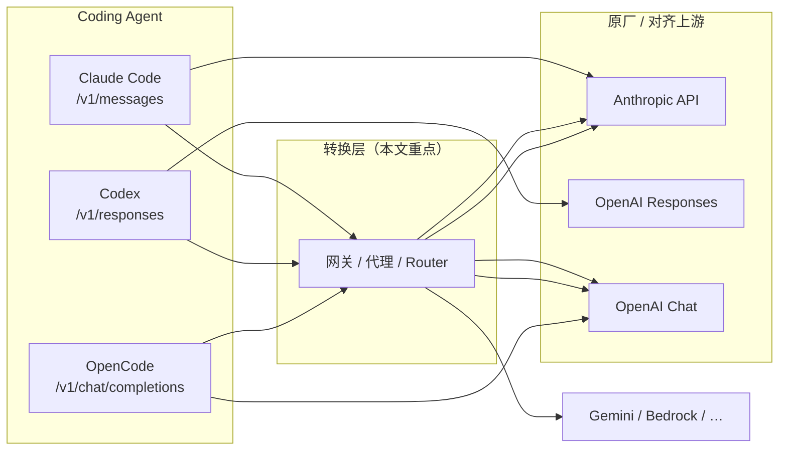

# 编程 Agent 协议转换与网关调研

> **副标题**：Claude Code · Codex · OpenCode 的模型路由与 HTTP 转换方案（含插件边界说明）  
> **文档类型**：方案地图 · **非** 兼容性认证报告 — 矩阵里的 ✅/◐ 表示 **设计意图或二手信息**；L3–L5 结论以 [reports/](../reports/) 及下文 **证据等级** 为准。  
> **范围**：Claude Code、Codex、OpenCode 三类终端编程 Agent  
> **与 [E2E 原生兼容性全景](./E2E原生兼容性全景.md) 的关系**：全景矩阵描述 **官方集成 × 原厂上游** 的原生对齐；本文描述 **非原生组合** 时，社区/网关如何实现 **协议转换与模型路由**。  
> **与 [中转站主流技术栈调研](./中转站主流技术栈调研.md) 的关系**：该文描述 **中转站产品如何实现聚合与转发**（Go/Gin、LiteLLM、商业 Token 站）；本文描述 **Agent 侧如何桥接或配置 BASE_URL**。  
> **不含**：Gemini CLI、Cursor、Aider 等（协议族或产品形态不同；Gemini 可另文补）。

### 文档元信息

| 项 | 内容 |
|----|------|
| **编写日期** | 2026-06-03 |
| **修订日期** | 2026-06-03（v2：成熟度表、证据等级、探测解读、失败模式） |
| **调研基线** | Claude Code `2.1.159` · Codex `0.133.0+`（仅 `wire_api = "responses"`）· OpenCode `1.15.13` |
| **复审触发** | 任 Agent 大版本变更主 wire、Codex 弃用 Chat 完成、或主流网关新增/废弃 `/v1/responses` / `/v1/messages` 转换面 |
| **待补实测** | 转换层 × 站点报告（模板见 [§12](#12-后续报告模板)）— 当前 **无** E4 级条目 |

---

## 目录

1. [问题定义](#1-问题定义)
2. [三类 Agent 的硬性协议要求](#2-三类-agent-的硬性协议要求)
3. [方案分类](#3-方案分类)
4. [Claude Code：转换与路由](#4-claude-code转换与路由)
5. [Codex：转换与路由](#5-codex转换与路由)
6. [OpenCode：Provider 与插件](#6-opencodeprovider-与插件)
7. [通用网关与中转站](#7-通用网关与中转站)
8. [对比矩阵与方案成熟度](#8-对比矩阵与方案成熟度)
9. [选型建议](#9-选型建议)
10. [风险、失败模式与验证清单](#10-风险失败模式与验证清单)
11. [参考链接](#11-参考链接)
12. [后续报告模板](#12-后续报告模板)

---

## 1. 问题定义

### 1.1 什么叫「模型转换」

在本仓库语境下，**模型转换** 指：Coding Agent 客户端固定使用某一种 **HTTP 协议族** 与模型对话，而目标上游（另一云厂商、本地推理、Token 中转站）只暴露 **不同协议族** 或 **裁剪后的端点子集**。中间层必须完成：

| 转换方向 | 典型场景 |
|----------|----------|
| **Anthropic Messages → OpenAI Chat** | Claude Code 对接 DeepSeek / Ollama / 仅 Chat 的中转站 |
| **OpenAI Responses → OpenAI Chat** | Codex 0.133+ 对接仅 Chat 的中转站（如 b.ai，见 [Codex 报告](../reports/Codex兼容性评估报告.md)） |
| **OpenAI Responses → Anthropic Messages** | Codex 经网关调用 Claude（需网关双向转换 + tool 语义对齐） |
| **OpenAI Chat → OpenAI Responses** | OpenCode 某模型走 `/v1/responses`（OpenCode 内置 AI SDK 选型，非外置插件） |
| **同协议换模型 ID** | 中转站已支持 Agent 所需端点，仅做模型名映射（**不算** 协议转换，但常与本节方案一起出现） |

### 1.2 「插件」在本调研中的含义

| 类型 | 说明 | 是否改变主推理 wire |
|------|------|---------------------|
| **A. HTTP 代理 / 网关** | 独立进程，Agent 通过 `*_BASE_URL` 指向 | ✅ 核心转换层 |
| **B. Agent 配置层** | `config.toml` / `settings.json` / `opencode.json` 指向上游或网关 | ⚠️ 仅转发，转换在网关或上游完成 |
| **C. Agent 运行时插件** | Codex 插件市场、OpenCode npm 插件、Claude MCP | ❌ 一般 **不** 替换 LLM 协议；扩展工具、技能、观测 |
| **D. 路由专用工具** | Claude Code Router、ccproxy 等 | ✅ 兼转换 + 按任务选模型 |

下文 **优先覆盖 A / D**（与「模型转换」直接相关），并单列各 Agent 的 **C 类插件** 边界，避免与网关混淆。

### 1.3 与 E2E 评估的关系

```text
原生 E2E（●）     = Agent 官方集成 × 上游官方协议面 × 工作流闭环
转换层 E2E（◐/?） = 上述任一 × 自建/第三方网关 × 需实测 L3–L5
```

本仓库 [reports/](../reports/) 已验证（**E3**）：**Claude Code + b.ai** 无需转换；**Codex + b.ai** 因缺 `/v1/responses` 必须桥接或换上游；**OpenCode + b.ai** 直连 Chat。转换层方案需在相同 L3–L5 维度复测（流式、tool 多轮、reasoning/thinking）。

### 1.4 证据等级

| 等级 | 含义 | 本文用法 |
|------|------|----------|
| **E0** | Agent / 云厂商 **官方文档** | 配置项、端点名称 |
| **E1** | 网关项目 README / 发行说明 | LiteLLM、CCR 功能声明 |
| **E2** | 社区讨论、第三方测评 | Codex #7782、Bedrock 网关对比文 |
| **E3** | **本仓库** `reports/` 实测 | b.ai × 三 Agent |
| **E4** | **本仓库** 转换层实测 | **尚无** — 见 [§12](#12-后续报告模板) |

阅读原则：**E0–E2 可指导选型与 PoC；上线或团队推广前至少做到 E3（直连）或 E4（经网关）。**

---

## 2. 三类 Agent 的硬性协议要求

| Agent | 主 wire | 客户端配置入口 | 0.133+ / 近期变更 |
|-------|---------|----------------|-------------------|
| **Claude Code** | `POST /v1/messages` | `ANTHROPIC_BASE_URL`、`ANTHROPIC_AUTH_TOKEN` / `ANTHROPIC_API_KEY` | v2.1.129+ 支持 Gateway `GET /v1/models` 模型发现（`CLAUDE_CODE_ENABLE_GATEWAY_MODEL_DISCOVERY=1`） |
| **Codex** | `POST /v1/responses`（可选 WebSocket） | `~/.codex/config.toml` → `[model_providers.*]`、`wire_api = "responses"`、`openai_base_url` | **0.133 起** 移除 `wire_api = "chat"`，Chat Completions 已弃用 |
| **OpenCode** | `POST /v1/chat/completions`（默认） | `opencode.json` → `provider` + AI SDK 包 | 单模型可 override 为 `@ai-sdk/openai` 走 `/v1/responses` |



---

## 3. 方案分类

| 层级 | 代表 | 适用 Agent | 特点 | 典型证据 |
|------|------|------------|------|----------|
| **L1 专用 Router** | Claude Code Router、ccproxy | Claude Code | Anthropic 入、多厂商出；任务路由 | E1 |
| **L2 轻量代理** | anthropic-proxy、CC-Adapter、codex-bridge 系 | Claude Code / Codex | 单进程、协议对协议 | E1–E2 |
| **L3 企业网关** | LiteLLM Proxy、New API、One API、Portkey | 三者（能力不一） | 多租户、鉴权、计费、观测 | E0–E2 |
| **L4 中转站直连** | b.ai 等 | Claude Code ✅ · OpenCode ✅ · Codex ❌ | 无转换，仅当端点已对齐 | **E3**（b.ai） |
| **L5 Agent 插件** | OpenCode npm 插件、Codex 市场插件 | 扩展行为 | **不** 替代 L1–L3 | E0 |

### 3.1 运维与成本粗估

| 层级 | 部署 | 适合人数 | 相对成本 | 备注 |
|------|------|----------|----------|------|
| L4 直连 | 无 | 个人–团队 | 仅上游 Token | 优先路径 |
| L1/L2 本地代理 | 本机或单 VM | 个人–小团队 | 上游 Token + 自运维 | CCR npm 周下载量高，但需常驻进程 |
| L3 网关 | K8s / Docker | 团队 | 上游 +  infra + 可能的 SaaS 费 | LiteLLM 可自托管；Portkey 偏 SaaS |
| L5 插件 | 随 Agent | 任意 | 通常无额外推理费 | 观测类可能另有账单 |

---

## 4. Claude Code：转换与路由

Claude Code **只认 Anthropic Messages**。对接非 Anthropic 模型时，必须让 `ANTHROPIC_BASE_URL` 指向 **已实现 `/v1/messages` 的网关**，由网关翻译到 OpenAI Chat、Gemini、Bedrock Converse 等。

### 4.1 官方支持的 Gateway 模式

Claude Code 官方文档 [LLM Gateway](https://code.claude.com/docs/en/llm-gateway)（**E0**）明确：`ANTHROPIC_BASE_URL` 可指向兼容 Messages 的网关（含中转站）。若网关同时提供 `GET /v1/models`，可开启模型发现：

```bash
export ANTHROPIC_BASE_URL="https://your-gateway.example"
export ANTHROPIC_AUTH_TOKEN="sk-..."
export CLAUDE_CODE_ENABLE_GATEWAY_MODEL_DISCOVERY=1
```

**本仓库实测（E3）**：[Claude Code + b.ai](../reports/ClaudeCode兼容性评估报告.md) 为 **同协议直连**（b.ai 原生 Messages），非转换。

### 4.2 Claude Code Router（musistudio/claude-code-router）

| 项 | 内容 |
|----|------|
| **仓库** | [musistudio/claude-code-router](https://github.com/musistudio/claude-code-router) |
| **成熟度** | GitHub ~34k stars（2026-03）；npm `@musistudio/claude-code-router` 2.x；社区活跃，open issues 多 |
| **形态** | 本地 HTTP 服务（默认 `http://127.0.0.1:3456`）+ CLI `ccr` |
| **转换核心** | 基于 `@musistudio/llms` 的 Transformer（anthropic / openai / gemini / deepseek / openrouter / groq 等） |
| **Agent 配置** | `ANTHROPIC_BASE_URL=http://127.0.0.1:3456` |
| **亮点** | 按场景路由（background / thinking / longContext / webSearch）；`/model` 动态切模型；自定义 Transformer **插件**；GitHub Actions |
| **局限** | 需自维护路由规则；thinking / tool 流式与上游能力绑定；**本仓库尚无 E4 实测** |

配置位于 `~/.claude-code-router/config.json`：`Providers[]` 定义 `api_base_url`、`transformer.use`、`models`；`Router` 段定义默认与分场景模型。

### 4.3 ccproxy（LiteLLM 系路由）

[starbaser/ccproxy](https://github.com/starbaser/ccproxy)（**E2**，~200 stars 量级）基于 **LiteLLM**，提供 TokenCountRule、MatchModelRule、ThinkingRule 等 **细粒度路由**，适合已部署 LiteLLM、需要比 CCR 更可控规则引擎的团队。与 CCR 二选一即可，不必叠两层。

### 4.4 轻量 Anthropic → OpenAI 代理

| 项目 | 语言 | 上游 | 成熟度 | 说明 |
|------|------|------|--------|------|
| [anthropic-proxy-rs](https://github.com/m0n0x41d/anthropic-proxy-rs) | Rust | OpenAI 兼容 Chat | 社区常用，crates.io 发布 | `REASONING_MODEL` / `COMPLETION_MODEL` 分流 thinking |
| [ersinkoc/anthropic-proxy](https://github.com/ersinkoc/anthropic-proxy) | Rust | OpenAI Chat | 轻量 | `FORCE_MODEL`、`MODEL_MAP`、热重载 |
| [Jakevin/CC-Adapter](https://github.com/Jakevin/CC-Adapter) | Rust | Chat / **Responses** / Grok / Anthropic 兼容站 | ~50 stars，单维护者，2026-03 新建，v0.5.x | Messages 双向转换；ChatGPT OAuth；tool/image/thinking |

**选型提示**：个人本地优先 **anthropic-proxy-rs** 或 **CCR**；需要 **Messages ↔ Responses 双栈** 时看 **CC-Adapter**（较新，建议 PoC 后再上生产）。

### 4.5 LiteLLM 作为 Claude Code 后端

LiteLLM Proxy 暴露 **`POST /v1/messages`**（**E1**），将请求译到 100+ Provider。教程：[Use Claude Code with Non-Anthropic Models](https://docs.litellm.ai/docs/tutorials/claude_non_anthropic_models)。

```bash
export ANTHROPIC_BASE_URL="http://127.0.0.1:4000"
export ANTHROPIC_AUTH_TOKEN="$LITELLM_MASTER_KEY"
export CLAUDE_CODE_ENABLE_GATEWAY_MODEL_DISCOVERY=1
```

社区对比（**E2**，Bedrock）：Claude Code → LiteLLM → Bedrock Converse **可 E2E**（含流式）；为 Messages 场景下较成熟的 L3 选项。

### 4.6 Claude Code「插件」边界（非模型转换）

| 机制 | 作用 |
|------|------|
| **MCP 服务器** | 扩展工具（数据库、浏览器等），不改变 LLM 端点 |
| **Agent SDK / 第三方集成** | 同样通过 `ANTHROPIC_BASE_URL` 走 Gateway |
| **settings.json `env`** | 注入 Base URL / Key，非转换逻辑 |

---

## 5. Codex：转换与路由

Codex **0.133+ 仅** `wire_api = "responses"`。上游若无 `/v1/responses`，必须在本地或内网部署 **Responses ↔ 目标协议** 桥接；Codex 侧仍配置 `wire_api = "responses"`。

### 5.1 官方自定义 Provider

[Codex Advanced Configuration](https://developers.openai.com/codex/config-advanced)（**E0**）：

```toml
model = "your-model-id"
model_provider = "proxy"

[model_providers.proxy]
name = "LLM proxy"
base_url = "http://127.0.0.1:8080/v1"
wire_api = "responses"
env_key = "OPENAI_API_KEY"
supports_websockets = false
# 可选：stream_idle_timeout_ms、request_max_retries、query_params（Azure api-version）
```

也可对内置 OpenAI Provider 仅设 `openai_base_url`。**转换发生在 `base_url` 所指服务**，非 Codex 内置。

### 5.2 Responses → Chat Completions 桥接（社区）

OpenAI [Discussion #7782](https://github.com/openai/codex/discussions/7782)（**E0/E2**）确认弃用 Chat；社区 **Responses 入、Chat 出** 方案：

| 项目 | 说明 | 成熟度 |
|------|------|--------|
| [va-ai-api-bridge](https://crates.io/crates/va-ai-api-bridge) | Rust 库；VibeAround 使用；通用 event 模型 | 库级，可嵌入自研 |
| [Virtual0ps/zai-codex-bridge](https://github.com/Virtual0ps/zai-codex-bridge) | Node，Responses ↔ Chat，SSE，可选 tool/MCP | 场景明确，维护需自评 |
| [wujfeng712-ui/codex-bridge](https://github.com/wujfeng712-ui/codex-bridge) | 多 Provider（DeepSeek、MiMo 等） | 实验性 |
| [xiaoshaoning/codex-bridge](https://github.com/xiaoshaoning/codex-bridge) | TypeScript，偏 DeepSeek | 实验性 |
| [352727664/CodexBridge](https://github.com/352727664/CodexBridge) | Python，多国产模型 | 实验性 |

典型拓扑（与 [Codex 报告 §9 方案 B](../reports/Codex兼容性评估报告.md) 一致）：

```text
Codex ──POST /v1/responses──▶ 本地 Bridge ──POST /v1/chat/completions──▶ 中转站 / Ollama
         ◀── Responses SSE ────              ◀── Chat SSE ───────────────
```

**实现难点**：`instructions` + `input` items 与 `messages[]` 互转；`function_call` / `function_call_output` / `reasoning` item；WebSocket Responses（多数桥仅 SSE）；Codex 内置 tool 类型（如 `web_search`）与上游 `function` tool 差异。

### 5.3 LiteLLM / OGX 等网关

| 网关 | Responses 面 | 备注 | 证据 |
|------|--------------|------|------|
| **LiteLLM** | ✅ `/v1/responses`（≥ 1.66.3） | Codex 教程；Bedrock 路径曾有 tool 名映射 Bug（**E2**） | E1–E2 |
| **OGX** | ✅ 自称 Responses 代理 | `wire_api = "responses"` + OGX `base_url` | E1 |
| **Portkey** | ✅ 统一 Responses / Messages | SaaS 网关 | E1 |
| **bedrock-access-gateway** | ❌ 无 `/v1/responses` | 仅 Chat，**不能** 直接接 Codex 0.133+ | E2 |
| **Bedrock mantle** | ◐ OpenAI 兼容路径 | [E2E 全景](./E2E原生兼容性全景.md) 对 Codex 记 **◐**；需自定义 `[model_providers.*]`，非内置 `amazon-bedrock` | E0 |

### 5.4 CC-Adapter 的特殊路径

[CC-Adapter](https://github.com/Jakevin/CC-Adapter) 面向 **Claude Code**，但支持 Messages **→ OpenAI Responses**（ChatGPT OAuth）。与 Codex 客户端路径不同，说明 Responses ↔ Messages 转换可复用，但 **不能** 假设「CC-Adapter 可直接当 Codex 后端」。

### 5.5 Codex「插件」边界

| 机制 | 作用 |
|------|------|
| **Codex 插件市场** | Browser、Spreadsheets、MCP 等 — **不** 替换 LLM API |
| **`[model_providers.*]`** | 换 Base URL / wire，转换在外部网关 |
| **`codex --oss`** | 官方 Ollama/LM Studio，**原生 Responses 对齐**（**E0**），非第三方转换 |

---

## 6. OpenCode：Provider 与插件

OpenCode 默认通过 **Vercel AI SDK** 调用 **`/v1/chat/completions`**。与 Claude Code / Codex 相比，**对 OpenAI Chat 兼容上游最友好**；「模型转换」需求通常 **最弱**。

### 6.1 Provider 配置（内置协议选型）

[OpenCode Providers](https://opencode.ai/docs/providers/)（**E0**）：

| npm 包 | 上游端点 | 场景 |
|--------|----------|------|
| `@ai-sdk/openai-compatible` | `/v1/chat/completions` | 大多数中转站、DeepSeek、Moonshot |
| `@ai-sdk/openai` | `/v1/responses` | 需 Responses 的 OpenAI 模型 |
| `@ai-sdk/anthropic` | Anthropic Messages | 直连 Anthropic |
| `@ai-sdk/amazon-bedrock` 等 | 各云原生 SDK | SDK 适配，非统一 HTTP 面 |

示例（**E3**，[OpenCode 报告](../reports/OpenCode兼容性评估报告.md)）：

```json
{
  "provider": {
    "bai": {
      "npm": "@ai-sdk/openai-compatible",
      "options": { "baseURL": "https://api.b.ai/v1" },
      "models": { "kimi-k2.5": { "name": "Kimi K2.5" } }
    }
  }
}
```

**结论**：OpenCode 换模型/上游 = **换 Provider + AI SDK 包**；仅当上游既非 Chat 也无法 SDK 直连时，才前置 LiteLLM / New API。

### 6.2 OpenCode 插件生态（非 LLM 协议转换）

| 插件示例 | 类型 | 与模型转换关系 |
|----------|------|----------------|
| `opencode-helicone-session` | 观测 / 会话 | 转换在 Helicone 网关 |
| `opencode-agent-skills` | 技能加载 | 上下文注入，不改 wire |
| `opencode-wakatime` | 统计 | 无关 |
| 自定义 `@opencode-ai/plugin` | 工具 / Hook | 扩展 `tool()`，不替换 Provider |

OpenCode **没有** CCR 级内置多协议 Router；多模型靠 **agent 级 `model`** + **Zen**（官方评测模型集，属 L4 商业路由，非自托管转换）。

### 6.3 OpenCode 经网关接 Claude / Responses

1. 前置 **LiteLLM**（`/v1/chat/completions`），OpenCode 仍用 `@ai-sdk/openai-compatible`；或  
2. 单模型 `"npm": "@ai-sdk/openai"` 指向 Responses 网关。

---

## 7. 通用网关与中转站

> 网关 **实现栈、Channel/Relay 架构、商业 Token 站形态** 见 **[中转站主流技术栈调研](./中转站主流技术栈调研.md)**。本节仅保留 **Agent 接入视角** 的端点能力与配置要点。

### 7.1 LiteLLM Proxy

| 端点 | Claude Code | Codex | OpenCode |
|------|:-----------:|:-----:|:--------:|
| `/v1/messages` | ✅ | — | —（可经 Chat 间接） |
| `/v1/responses` | — | ✅（≥ 1.66.3，tool 映射需 E4） | ⚠️ `@ai-sdk/openai` |
| `/v1/chat/completions` | — | —（Codex 不用） | ✅ |

适合 **团队统一入口**：Virtual Key、预算、审计、fallback。Coding Agent 场景 **必须** 单独验证 tool 多轮与流式。

**版本提示（E2）**：锁定 LiteLLM 版本并记录于报告；升级后重跑 L4 tool 探针。

### 7.2 New API / One API（中转管理面）

本仓库 `upstream/pull.sh newapi` 可拉取参考实现到 `upstream/newapi/`。典型能力：

- 聚合多 Key、模型映射、渠道权重  
- 常暴露 **OpenAI Chat** + **Anthropic Messages**  
- **`/v1/responses` 因部署版本、渠道、管理员开关而异** — 不可凭文档假设  

#### 用 `probe-endpoints.sh` 解读中转站

```bash
./experiment/user-side/scripts/probe-endpoints.sh <site>
```

脚本（`experiment/user-side/lib/maas.py probe-endpoints`）对站点 `base_url` 探测四项并给出 **Agent readiness**：

| 探测 | 通过时含义 | 对应 Agent |
|------|------------|------------|
| `GET /v1/models` | 模型发现可用 | 辅助项 |
| `POST /v1/chat/completions` | Chat 协议可达 | **OpenCode** |
| `POST /v1/messages` | Messages 协议可达 | **Claude Code** |
| `POST /v1/responses` | Responses 协议可达 | **Codex** |

**b.ai 实测（E3）** 典型输出逻辑：`chat` + `messages` = OK，`responses` = 404/403 → Claude Code / OpenCode **直连**，Codex **否**。

若自建 New API 仍缺 `/v1/responses`，Codex 路径为：**New API（Chat）← codex-bridge ← Codex**，而非强行改 `wire_api = "chat"`（0.133+ 已不支持）。

### 7.3 其他 SaaS 网关

| 产品 | 说明 |
|------|------|
| [Portkey](https://portkey.ai/) | Responses / Messages / Chat 统一面，偏可观测与路由 |
| [Helicone](https://helicone.ai/) | 常与 OpenCode 插件配合 |
| [OpenRouter](https://openrouter.ai/) | 模型聚合；需再包装成 Messages 或 Responses 方可对接 Claude Code / Codex |

---

## 8. 对比矩阵与方案成熟度

### 8.1 按 Agent × 转换需求

| 需求 | 推荐路径 | 复杂度 | 建议证据目标 |
|------|----------|--------|--------------|
| Claude Code → 仅 Chat 上游 | CCR / anthropic-proxy / LiteLLM `/v1/messages` | 中 | E4 |
| Claude Code → 已支持 Messages 的中转站 | 直连 `ANTHROPIC_BASE_URL` | 低 | **E3** |
| Codex → 仅 Chat 上游 | codex-bridge / LiteLLM Responses / OGX | **高** | E4 |
| Codex → OpenAI / Azure Responses | 直连或 `openai_base_url` | 低 | E3 |
| OpenCode → Chat 兼容站 | `@ai-sdk/openai-compatible` | 低 | **E3** |
| OpenCode → 非 Chat 云 API | 换 `@ai-sdk/*` 或前置 LiteLLM | 中 | E4 |
| 三 Agent 统一网关 | LiteLLM（三端点逐项确认） | 高 | E4 |

### 8.2 主流方案能力概览

| 方案 | Messages | Responses | 路由 | 插件扩展 | 运维 | 证据 |
|------|:--------:|:---------:|:----:|:--------:|------|------|
| Claude Code Router | ✅ | ❌ | ✅ 强 | ✅ Transformer | 本地 | E1 |
| ccproxy | ✅ | ◐ | ✅ 规则引擎 | Hook | LiteLLM 旁 | E2 |
| CC-Adapter | ✅ | ✅ 出向 | 映射 | ❌ | 本地 | E1 |
| anthropic-proxy 系 | ✅ | ❌ | 映射 | ❌ | 本地 | E1 |
| codex-bridge 系 | ❌ | ✅ 入向 | 按项目 | ❌ | 本地 | E1–E2 |
| LiteLLM | ✅ | ✅ | ✅ | Guardrail | 服务化 | E1–E2 |
| New API / One API | ◐ | ◐ | ✅ | 渠道 | 自托管 | E2 + probe |
| OpenCode npm 插件 | ❌ | ❌ | ❌ | ✅ 工具 | 随 Agent | E0 |

图例：✅ 明确支持 · ◐ 依赖版本/配置 · ❌ 非设计目标

### 8.3 方案成熟度（2026-06-03 文献调研）

> Stars / 更新时间来自 GitHub 公开页，**不代表** L3–L5 可用性；「生产建议」结合社区规模与维护信号。

| 方案 | 规模信号 | 维护信号 | 生产建议 | 本仓库 E4 |
|------|----------|----------|----------|-----------|
| **LiteLLM** | 超大社区 | 活跃发行、企业采用多 | 团队首选 L3；锁版本 + 实测 | 无 |
| **Claude Code Router** | ~34k stars | 2026-03 仍有 push；issues 多 | 个人/小团队 Claude Code 换模型首选 | 无 |
| **anthropic-proxy-rs** | 中等 | crates 发布 | 轻量 Messages→Chat | 无 |
| **CC-Adapter** | ~50 stars | 2026-04 v0.5.x；单维护者 | PoC / 个人；生产需自担风险 | 无 |
| **codex-bridge 系** | 小 | 分散、实验性 | **仅 PoC**；优先评估 LiteLLM 或换 Agent | 无 |
| **va-ai-api-bridge** | 库 | crates | 自研桥接的基础组件 | 无 |
| **New API / One API** | 大（自托管圈） | 随 fork 而异 | 先 **probe**，再定是否外置 bridge | 无（b.ai 为 E3 直连） |

---

## 9. 选型建议

### 9.1 按场景

| 场景 | 建议 |
|------|------|
| 个人：Claude Code + 本地 Ollama | **CCR** 或 **anthropic-proxy-rs** |
| 个人：Codex + 仅 Chat 中转站 | **LiteLLM Responses** 或 **codex-bridge PoC**；长期更稳是换 **OpenCode / Claude Code** |
| 团队：多 Agent、多模型、审计 | **LiteLLM** 统一部署；三端点分别配置 |
| 已购 b.ai 类中转站 | **Claude Code + OpenCode 直连（E3）**；Codex 除非站点 probe 通过 `/v1/responses` 否则 **不建议** |
| 希望最少运维 | [E2E 全景 §3](./E2E原生兼容性全景.md#3-兼容性总矩阵) **原生 ●**，避免桥接 |

### 9.2 Claude Code：CCR vs LiteLLM vs 轻量代理

| 维度 | CCR | LiteLLM | anthropic-proxy-rs |
|------|-----|---------|---------------------|
| 部署重量 | 低（单进程） | 高 | 极低 |
| 多 Provider 路由 | ✅ 内置场景路由 | ✅ 企业级 | ❌  mainly 映射 |
| 团队鉴权/计费 | ❌ | ✅ | ❌ |
| 适合 | 个人、多模型省钱 | 团队平台 | 单一 OpenAI 兼容后端 |

### 9.3 Codex：桥接 vs 换 Agent

| 维度 | 部署 codex-bridge | 换 Claude Code / OpenCode |
|------|-------------------|---------------------------|
| 保留 Codex UX | ✅ | ❌ |
| 工程复杂度 | 高（L4 tool 易失败） | 低（b.ai 已 E3） |
| 维护 | 自维护桥 + 上游 | 仅上游 |
| **b.ai 用户** | 不推荐为首选项 | **推荐** |

### 9.4 决策流

```text
1. 确定 Agent → 硬性端点（messages / responses / chat）
2. ./experiment/user-side/scripts/probe-endpoints.sh <site>
   ├─ 对应端点 OK → 直连（t_*），写 E3 report
   └─ 否 → 选 L1/L2/L3 网关
3. PoC 网关 → L3 流式 → L4 tool 多轮 → L5 thinking
4. 通过 → docs/reports/ 转换层报告（E4）；失败 → 记录 §10.2 失败模式
```

---

## 10. 风险、失败模式与验证清单

### 10.1 风险与缓解

| 风险 | 影响 Agent | 缓解 |
|------|------------|------|
| Tool 格式不一致 | 三者 | 桥接层必须测 **多轮** Bash/Read/Edit |
| Codex 内置 tool 类型（`web_search` 等） | Codex | 网关丢弃或映射为 `function` |
| Extended thinking / reasoning | Claude Code、Codex | 确认分流模型或透传 |
| 流式 idle 超时 | Codex | `stream_idle_timeout_ms`；CC-Adapter 时 `CLAUDE_STREAM_IDLE_TIMEOUT_MS` |
| WebSocket Responses | Codex | 多数桥仅 SSE → `supports_websockets = false` |
| 模型 ID 幻觉 | 经网关 | `FORCE_MODEL` / Router 默认 / Gateway 发现 |
| LiteLLM 版本回归 | Codex + Bedrock 等 | 锁版本、升级后重测 L4 |
| 密钥泄露 | 全部 | 网关与 Agent 分 Key |

### 10.2 已知失败模式（反例）

> 来源：**E2/E3**；用于说明「端点存在 ≠ Agent 可用」。

| 现象 | 根因 | 涉及 | 证据 |
|------|------|------|------|
| Codex `doctor` WebSocket 403 | 上游无 Responses WS | Codex + b.ai | **E3** |
| Codex 报「model only supported in v1/responses」 | 上游仅 Chat | Codex + b.ai | **E3** |
| Claude Code Sonnet 403 | 账户/渠道权限，非协议 | Claude Code + b.ai | **E3** |
| LiteLLM → Bedrock tool 校验失败 | `toolSpec.name` 映射空 | Codex + LiteLLM | **E2** |
| CCR + 弱 tool 模型 | 上游不支持 function calling | Claude Code | **E2** 归纳 |
| 桥接层 L2 200 但 L4 失败 | items/messages 多轮上下文丢失 | Codex bridge | **E2** 归纳 |

### 10.3 最小验证命令

```bash
# L2 协议探测
./experiment/user-side/scripts/probe-endpoints.sh <site>

# E3/E4 Agent 探针（直连或转换层配置完成后）
./experiment/user-side/t_claude --site <site> --model <model> -y
./experiment/user-side/t_codex --site <site> --model <model> -y
./experiment/user-side/t_opencode --site <site> --model <model> -y
```

通过标准与 [E2E 全景 §1.2](./E2E原生兼容性全景.md#12-图例与评估分层) L3–L5 一致。**转换层至少完成 L4（tool 多轮）再记为 E4 通过。**

---

## 11. 参考链接

### 官方文档

- [Claude Code LLM Gateway](https://code.claude.com/docs/en/llm-gateway)
- [Claude Code Environment variables](https://code.claude.com/docs/en/env-vars)
- [Codex Advanced Configuration](https://developers.openai.com/codex/config-advanced)
- [Codex 弃用 Chat Completions #7782](https://github.com/openai/codex/discussions/7782)
- [OpenCode Providers](https://opencode.ai/docs/providers/)
- [OpenCode Plugins](https://opencode.ai/docs/plugins/)

### 网关与转换项目

- [musistudio/claude-code-router](https://github.com/musistudio/claude-code-router)
- [starbaser/ccproxy](https://github.com/starbaser/ccproxy)
- [Jakevin/CC-Adapter](https://github.com/Jakevin/CC-Adapter)
- [m0n0x41d/anthropic-proxy-rs](https://github.com/m0n0x41d/anthropic-proxy-rs)
- [ersinkoc/anthropic-proxy](https://github.com/ersinkoc/anthropic-proxy)
- [Virtual0ps/zai-codex-bridge](https://github.com/Virtual0ps/zai-codex-bridge)
- [va-ai-api-bridge (crates.io)](https://crates.io/crates/va-ai-api-bridge)
- [BerriAI/litellm](https://github.com/BerriAI/litellm) — [/v1/messages](https://docs.litellm.ai/docs/anthropic_unified/)

### 本仓库

- [E2E 原生兼容性全景](./E2E原生兼容性全景.md)
- [中转站主流技术栈调研](./中转站主流技术栈调研.md)
- [兼容性评估报告索引](../reports/README.md)
- [Codex × b.ai 不兼容](../reports/Codex兼容性评估报告.md)
- [Claude Code × b.ai 基本兼容](../reports/ClaudeCode兼容性评估报告.md)
- [OpenCode × b.ai 兼容](../reports/OpenCode兼容性评估报告.md)

---

## 12. 后续报告模板

将任意 **网关 × 站点 × Agent** 组合从本文 **E2 → E4** 时，在 `docs/reports/` 新增报告，建议包含：

| 章节 | 内容 |
|------|------|
| 评估对象 | 网关名称 + 版本号（如 `litellm 1.82.5`） |
| 拓扑 | `Agent → 网关:端口/路径 → 上游 site` |
| L2 | `probe-endpoints` 或 curl 截图 |
| L3 | 流式是否挂起 |
| L4 | tool 多轮（Bash/Read 或 Codex shell） |
| L5 | thinking / reasoning（若适用） |
| 结论 | 🟢/🟡/🔴 + 是否推荐生产 |
| 配置片段 | 脱敏后的 `config.toml` / `settings.json` / LiteLLM yaml |

**优先建议的 E4 候选**（填补本文最大空白）：

1. `LiteLLM /v1/responses` + b.ai Chat 渠道 + Codex  
2. `CCR` + DeepSeek + Claude Code（L4 tool）  
3. 自建 New API + `probe-endpoints` 全绿时的 Codex 直连（若未来 b.ai 上线 Responses）

---

**一句话**：Claude Code 要 **Messages 网关**，Codex 要 **Responses 桥**，OpenCode 要 **Chat 或 SDK**；「插件」多数扩展工具而非换协议 — 真正的转换在 **Router / 代理 / LiteLLM** 层完成；本文是 **方案地图（E0–E2）+ b.ai 锚点（E3）**，上线前请补 **E4 实测**。
