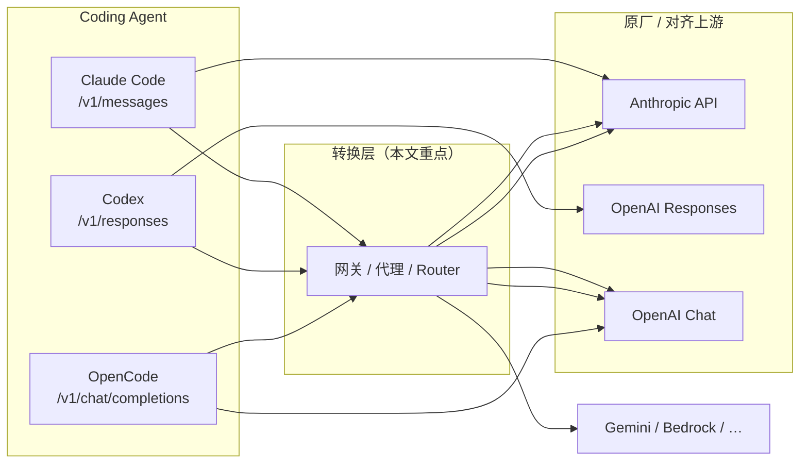

# 编程 Agent 模型转换与插件调研

> **文档类型**：调研参考 · **范围**：Claude Code、Codex、OpenCode 三类主流终端编程 Agent  
> **与 [E2E 原生兼容性全景](./E2E原生兼容性全景.md) 的关系**：全景矩阵描述 **官方集成 × 原厂上游** 的原生对齐；本文描述 **非原生组合** 时，社区/网关/插件如何实现 **协议转换与模型路由**。  
> **不含**：Gemini CLI（独立 `generateContent` 协议族，转换生态与 OpenAI/Anthropic 三 Agent 差异较大，另文可补）。

### 文档元信息

| 项 | 内容 |
|----|------|
| **编写日期** | 2026-06-03 |
| **调研基线** | Claude Code `2.1.159` · Codex `0.133.0+`（仅 `wire_api = "responses"`）· OpenCode `1.15.13` |
| **复审触发** | 任 Agent 大版本变更主 wire、Codex 弃用 Chat 完成、或主流网关新增/废弃 `/v1/responses` / `/v1/messages` 转换面 |

---

## 目录

1. [问题定义](#1-问题定义)
2. [三类 Agent 的硬性协议要求](#2-三类-agent-的硬性协议要求)
3. [方案分类](#3-方案分类)
4. [Claude Code：转换与路由](#4-claude-code转换与路由)
5. [Codex：转换与路由](#5-codex转换与路由)
6. [OpenCode：Provider 与插件](#6-opencodeprovider-与插件)
7. [通用网关与中转站](#7-通用网关与中转站)
8. [对比矩阵](#8-对比矩阵)
9. [选型建议](#9-选型建议)
10. [风险与验证清单](#10-风险与验证清单)
11. [参考链接](#11-参考链接)

---

## 1. 问题定义

### 1.1 什么叫「模型转换」

在本仓库语境下，**模型转换** 指：Coding Agent 客户端固定使用某一种 **HTTP 协议族** 与模型对话，而目标上游（另一云厂商、本地推理、Token 中转站）只暴露 **不同协议族** 或 **裁剪后的端点子集**。中间层必须完成：

| 转换方向 | 典型场景 |
|----------|----------|
| **Anthropic Messages → OpenAI Chat** | Claude Code 对接 DeepSeek / Ollama / 仅 Chat 的中转站 |
| **OpenAI Responses → OpenAI Chat** | Codex 0.133+ 对接仅 Chat 的中转站（如 b.ai，见 [Codex 报告](./reports/Codex兼容性评估报告.md)） |
| **OpenAI Responses → Anthropic Messages** | Codex 经网关调用 Claude（需网关双向转换 + tool 语义对齐） |
| **OpenAI Chat → OpenAI Responses** | OpenCode 某模型走 `/v1/responses`（OpenCode 内置 AI SDK 选型，非外置插件） |
| **同协议换模型 ID** | 中转站已支持 Agent 所需端点，仅做模型名映射（**不算** 协议转换，但常与本节方案一起出现） |

### 1.2 「插件」在本调研中的含义

| 类型 | 说明 | 是否改变主推理 wire |
|------|------|---------------------|
| **A. HTTP 代理 / 网关** | 独立进程，Agent 通过 `*_BASE_URL` 指向 | ✅ 核心转换层 |
| **B. Agent 配置层** | `config.toml` / `settings.json` / `opencode.json` 指向上游或网关 | ⚠️ 仅转发，转换在网关或上游完成 |
| **C. Agent 运行时插件** | Codex 插件市场、OpenCode npm 插件、Claude MCP | ❌ 一般 **不** 替换 LLM 协议；扩展工具、技能、观测 |
| **D. 路由专用工具** | Claude Code Router 等 | ✅ 兼转换 + 按任务选模型 |

下文 **优先覆盖 A / D**（与「模型转换」直接相关），并单列各 Agent 的 **C 类插件** 边界，避免与网关混淆。

### 1.3 与 E2E 评估的关系

```text
原生 E2E（●）     = Agent 官方集成 × 上游官方协议面 × 工作流闭环
转换层 E2E（◐/?） = 上述任一 × 自建/第三方网关 × 需实测 L3–L5
```

本仓库 [reports/](./reports/) 已验证：**Claude Code + b.ai** 无需转换；**Codex + b.ai** 因缺 `/v1/responses` 必须桥接或换上游；**OpenCode + b.ai** 直连 Chat。转换层方案需在相同 L3–L5 维度复测（流式、tool 多轮、reasoning/thinking）。

---

## 2. 三类 Agent 的硬性协议要求

| Agent | 主 wire | 客户端配置入口 | 0.133+ / 近期变更 |
|-------|---------|----------------|-------------------|
| **Claude Code** | `POST /v1/messages` | `ANTHROPIC_BASE_URL`、`ANTHROPIC_AUTH_TOKEN` / `ANTHROPIC_API_KEY` | v2.1.129+ 支持 Gateway `GET /v1/models` 模型发现（`CLAUDE_CODE_ENABLE_GATEWAY_MODEL_DISCOVERY=1`） |
| **Codex** | `POST /v1/responses`（可选 WebSocket） | `~/.codex/config.toml` → `[model_providers.*]`、`wire_api = "responses"`、`openai_base_url` | **0.133 起** 移除 `wire_api = "chat"`，Chat Completions 已弃用 |
| **OpenCode** | `POST /v1/chat/completions`（默认） | `opencode.json` → `provider` + AI SDK 包 | 单模型可 override 为 `@ai-sdk/openai` 走 `/v1/responses` |



---

## 3. 方案分类

| 层级 | 代表 | 适用 Agent | 特点 |
|------|------|------------|------|
| **L1 专用 Router** | Claude Code Router | Claude Code | Anthropic 入、多厂商出；任务路由、Transformer 插件 |
| **L2 轻量代理** | anthropic-proxy、CC-Adapter、codex-bridge 系 | Claude Code / Codex | 单仓库、本地部署、协议对协议 |
| **L3 企业网关** | LiteLLM Proxy、New API、One API、Portkey | 三者（能力不一） | 多租户、鉴权、计费、观测；端点覆盖需逐项核对 |
| **L4 中转站直连** | b.ai 等 | Claude Code ✅ · OpenCode ✅ · Codex ❌ | 无转换，仅当端点已对齐 |
| **L5 Agent 插件** | OpenCode npm 插件、Codex 市场插件 | 扩展行为 | **不** 替代 L1–L3 |

---

## 4. Claude Code：转换与路由

Claude Code **只认 Anthropic Messages**。对接非 Anthropic 模型时，必须让 `ANTHROPIC_BASE_URL` 指向 **已实现 `/v1/messages` 的网关**，由网关翻译到 OpenAI Chat、Gemini、Bedrock Converse 等。

### 4.1 官方支持的 Gateway 模式

Claude Code 官方文档 [LLM Gateway](https://code.claude.com/docs/en/llm-gateway) 明确：`ANTHROPIC_BASE_URL` 可指向兼容 Messages 的网关（含中转站）。若网关同时提供 `GET /v1/models`，可开启模型发现：

```bash
export ANTHROPIC_BASE_URL="https://your-gateway.example"
export ANTHROPIC_AUTH_TOKEN="sk-..."
export CLAUDE_CODE_ENABLE_GATEWAY_MODEL_DISCOVERY=1
```

**本仓库实测**：[Claude Code + b.ai](./reports/ClaudeCode兼容性评估报告.md) 为 **同协议直连**（b.ai 原生 Messages），非转换。

### 4.2 Claude Code Router（musistudio/claude-code-router）

| 项 | 内容 |
|----|------|
| **仓库** | [musistudio/claude-code-router](https://github.com/musistudio/claude-code-router) |
| **形态** | 本地 HTTP 服务（默认 `http://127.0.0.1:3456`）+ CLI `ccr` |
| **转换核心** | 基于 `@musistudio/llms` 的 Transformer（anthropic / openai / gemini / deepseek / openrouter / groq 等） |
| **Agent 配置** | `ANTHROPIC_BASE_URL=http://127.0.0.1:3456` |
| **亮点** | 按场景路由（background / thinking / longContext / webSearch）；`/model` 动态切模型；自定义 Transformer **插件**；GitHub Actions 集成 |
| **局限** | 需自维护路由规则；thinking / tool 流式与上游能力绑定，需按目标模型实测 |

配置位于 `~/.claude-code-router/config.json`：`Providers[]` 定义 `api_base_url`、`transformer.use`、`models`；`Router` 段定义默认与分场景模型。

### 4.3 轻量 Anthropic → OpenAI 代理

| 项目 | 语言 | 上游 | 说明 |
|------|------|------|------|
| [anthropic-proxy-rs](https://github.com/m0n0x41d/anthropic-proxy-rs) / [crates.io anthropic-proxy](https://lib.rs/crates/anthropic-proxy) | Rust | OpenAI 兼容 Chat | `REASONING_MODEL` / `COMPLETION_MODEL` 分流 extended thinking |
| [ersinkoc/anthropic-proxy](https://github.com/ersinkoc/anthropic-proxy) | Rust | OpenAI Chat | `FORCE_MODEL`、`MODEL_MAP`、热重载 |
| [Jakevin/CC-Adapter](https://github.com/Jakevin/CC-Adapter) | Rust | OpenAI Chat / **OpenAI Responses** / Grok / Anthropic 兼容站 | Messages 双向转换；支持 ChatGPT OAuth（Codex 后端）；tool/image/thinking |

### 4.4 LiteLLM 作为 Claude Code 后端

LiteLLM Proxy 暴露 **`POST /v1/messages`**，将请求译到 100+ Provider（[文档](https://docs.litellm.ai/docs/anthropic_unified/)）。官方教程：[Use Claude Code with Non-Anthropic Models](https://docs.litellm.ai/docs/tutorials/claude_non_anthropic_models)。

```bash
export ANTHROPIC_BASE_URL="http://127.0.0.1:4000"
export ANTHROPIC_AUTH_TOKEN="$LITELLM_MASTER_KEY"
export CLAUDE_CODE_ENABLE_GATEWAY_MODEL_DISCOVERY=1
```

社区对比（Bedrock 场景）：Claude Code → LiteLLM → Bedrock Converse **可 E2E**（含流式）；为 **Messages 协议** 场景下较成熟的网关选项之一。

### 4.5 Claude Code「插件」边界（非模型转换）

| 机制 | 作用 |
|------|------|
| **MCP 服务器** | 扩展工具（数据库、浏览器等），不改变 LLM 端点 |
| **Agent SDK / 第三方集成** | 同样通过 `ANTHROPIC_BASE_URL` 走 Gateway |
| **settings.json `env`** | 注入 Base URL / Key，非转换逻辑 |

---

## 5. Codex：转换与路由

Codex **0.133+ 仅** `wire_api = "responses"`。上游若无 `/v1/responses`，必须在本地或内网部署 **Responses ↔ 目标协议** 桥接；Codex 侧仍配置 `wire_api = "responses"`。

### 5.1 官方自定义 Provider

[Codex Advanced Configuration](https://developers.openai.com/codex/config-advanced) 支持：

```toml
model = "your-model-id"
model_provider = "proxy"

[model_providers.proxy]
name = "LLM proxy"
base_url = "http://127.0.0.1:8080/v1"
wire_api = "responses"
env_key = "OPENAI_API_KEY"
# 可选：stream_idle_timeout_ms、request_max_retries、query_params（Azure api-version）
```

也可对内置 OpenAI Provider 仅设 `openai_base_url`（不新增 `model_providers.openai` 块）。**转换发生在 `base_url` 所指服务**，非 Codex 内置。

### 5.2 Responses → Chat Completions 桥接（社区）

OpenAI [Discussion #7782](https://github.com/openai/codex/discussions/7782) 确认弃用 Chat；社区常见 **Responses 入、Chat 出** 方案：

| 项目 | 说明 |
|------|------|
| [va-ai-api-bridge](https://crates.io/crates/va-ai-api-bridge) | Rust 通用转换库；VibeAround API Bridge 使用；双向 event 重组 |
| [Virtual0ps/zai-codex-bridge](https://github.com/Virtual0ps/zai-codex-bridge) | Node，Responses ↔ Chat，SSE，可选 tool/MCP 桥 |
| [wujfeng712-ui/codex-bridge](https://github.com/wujfeng712-ui/codex-bridge) | 多 Provider（DeepSeek、MiMo 等） |
| [xiaoshaoning/codex-bridge](https://github.com/xiaoshaoning/codex-bridge) | TypeScript，偏 DeepSeek |
| [352727664/CodexBridge](https://github.com/352727664/CodexBridge) | Python，多国产模型 |

典型拓扑（与 [Codex 报告 §9 方案 B](./reports/Codex兼容性评估报告.md) 一致）：

```text
Codex ──POST /v1/responses──▶ 本地 Bridge ──POST /v1/chat/completions──▶ 中转站 / Ollama
         ◀── Responses SSE ────              ◀── Chat SSE ───────────────
```

**实现难点**：`instructions` + `input` items 与 `messages[]` 互转；`function_call` / `function_call_output` / `reasoning` item 类型；WebSocket Responses（部分桥仅 SSE）；Codex 内置 tool 类型（如 `web_search`）与上游 `function` tool 差异。

### 5.3 LiteLLM / OGX 等网关

| 网关 | Responses 面 | 备注 |
|------|--------------|------|
| **LiteLLM** | ✅ `/v1/responses`（v1.66.3+） | 有 Codex 教程；社区反馈部分版本存在 tool 名映射 Bug（Bedrock 等），需锁定版本复测 |
| **OGX** | ✅ 自称 Responses 代理 | Codex 配置 `wire_api = "responses"` + `base_url` 指向 OGX；支持 Ollama / Bedrock 等 |
| **Portkey** | ✅ 统一 Responses / Messages | 偏 SaaS 网关，多 Provider 路由 |
| **bedrock-access-gateway** | ❌ 无 `/v1/responses` | 仅 Chat，**不能** 直接接 Codex 0.133+ |

### 5.4 CC-Adapter 的特殊路径

[CC-Adapter](https://github.com/Jakevin/CC-Adapter) 面向 **Claude Code**，但支持将 Messages **译为 OpenAI Responses** 并走 ChatGPT OAuth（Codex 后端）。这是 **Claude Code → OpenAI Responses** 方向，与 Codex 客户端路径不同，但说明 Responses 与 Messages 之间存在可复用的转换层设计。

### 5.5 Codex「插件」边界

| 机制 | 作用 |
|------|------|
| **Codex 插件市场** | Browser、Spreadsheets、MCP（如 `node_repl`）等 — **不** 替换 LLM API |
| **`[model_providers.*]`** | 换 Base URL / wire，转换在外部网关 |
| **`codex --oss`** | 官方 Ollama/LM Studio 路径，**原生 Responses 对齐**，非第三方转换 |

---

## 6. OpenCode：Provider 与插件

OpenCode 默认通过 **Vercel AI SDK** 调用 **`/v1/chat/completions`**。与 Claude Code / Codex 相比，**对 OpenAI Chat 兼容上游最友好**；「模型转换」需求通常 **弱于** 另两者。

### 6.1 Provider 配置（内置「转换」选型）

[OpenCode Providers](https://opencode.ai/docs/providers/) 通过 `opencode.json` 选择 npm 包：

| npm 包 | 上游端点 | 场景 |
|--------|----------|------|
| `@ai-sdk/openai-compatible` | `/v1/chat/completions` | 大多数中转站、DeepSeek、Moonshot |
| `@ai-sdk/openai` | `/v1/responses` | 需 Responses 的 OpenAI 模型 |
| `@ai-sdk/anthropic` | Anthropic Messages | 直连 Anthropic |
| `@ai-sdk/amazon-bedrock` 等 | 各云原生 SDK | 非 HTTP 统一面，由 SDK 适配 |

示例（与本仓库 [OpenCode 报告](./reports/OpenCode兼容性评估报告.md) 一致）：

```json
{
  "provider": {
    "bai": {
      "npm": "@ai-sdk/openai-compatible",
      "options": { "baseURL": "https://api.b.ai/v1" },
      "models": { "kimi-k2.5": { "name": "Kimi K2.5" } }
    }
  }
}
```

**结论**：OpenCode 的「换模型 / 换上游」主要是 **换 Provider + AI SDK 包**，而非外置 HTTP 插件；仅当上游 **既不是 Chat 也不是 SDK 直连** 时才需要 **前置 LiteLLM / New API** 等网关。

### 6.2 OpenCode 插件生态（非 LLM 协议转换）

[OpenCode Plugins](https://opencode.ai/docs/plugins/)：`plugin` 数组加载 npm 包或 `.opencode/plugins/` 本地 TS。

| 插件示例 | 类型 | 与模型转换关系 |
|----------|------|----------------|
| `opencode-helicone-session` | 观测 / 会话 | 可配合 Helicone 网关，转换在 Helicone |
| `opencode-agent-skills` | 技能加载 | 上下文注入，不改 wire |
| `opencode-wakatime` | 统计 | 无关 |
| 自定义 `@opencode-ai/plugin` | 工具 / Hook | 扩展 `tool()`，不替换 Provider |

OpenCode **没有** 与 Claude Code Router 同级的「内置多协议 Router」；多模型路由靠 **agent 级 `model` 配置** + **Zen**（官方评测模型集）。

### 6.3 OpenCode 经网关接 Claude / Responses

若只有 Anthropic Messages 或只有 Responses 的上游，可选：

1. 前置 **LiteLLM**（暴露 `/v1/chat/completions` 或 OpenAI 兼容面），OpenCode 仍用 `@ai-sdk/openai-compatible`；或  
2. 对单模型设 `"npm": "@ai-sdk/openai"` 直连支持 Responses 的网关。

---

## 7. 通用网关与中转站

### 7.1 LiteLLM Proxy

| 端点 | Claude Code | Codex | OpenCode |
|------|:-----------:|:-----:|:--------:|
| `/v1/messages` | ✅ | — | —（可经 Chat 间接） |
| `/v1/responses` | — | ✅（需版本 ≥ 1.66.3，实测 tool 映射） | ⚠️ 配合 `@ai-sdk/openai` |
| `/v1/chat/completions` | — | —（Codex 不用） | ✅ |

适合 **团队统一入口**：Virtual Key、预算、审计、fallback。Coding Agent 场景需 **单独** 验证 tool 多轮与流式。

### 7.2 New API / One API（中转管理面）

本仓库 `scripts/pull-upstream.sh newapi` 可拉取参考实现。典型能力：

- 聚合多 Key、模型映射、渠道权重  
- 常暴露 **OpenAI Chat** + **Anthropic Messages**  
- **`/v1/responses` 支持因部署版本与渠道而异** — 接入 Codex 前必须 `./scripts/probe-endpoints.sh` 或 curl 实测  

与 Claude Code / OpenCode 组合较多；与 Codex 组合 **取决于是否启用 Responses 路由或外置 codex-bridge**。

### 7.3 其他 SaaS 网关

| 产品 | 说明 |
|------|------|
| [Portkey](https://portkey.ai/) | Responses / Messages / Chat 统一面，偏可观测与路由 |
| [Helicone](https://helicone.ai/) | 常与 OpenCode 插件配合，代理 OpenAI 兼容请求 |
| [OpenRouter](https://openrouter.ai/) | 模型聚合；需网关再包装成 Messages 或 Responses 方可对接 Claude Code / Codex |

---

## 8. 对比矩阵

### 8.1 按 Agent × 转换需求

| 需求 | 推荐路径 | 复杂度 |
|------|----------|--------|
| Claude Code → 仅 Chat 上游 | CCR / anthropic-proxy / LiteLLM `/v1/messages` | 中 |
| Claude Code → 已支持 Messages 的中转站 | 直连 `ANTHROPIC_BASE_URL` | 低 |
| Codex → 仅 Chat 上游 | codex-bridge 系 / LiteLLM Responses / OGX | **高** |
| Codex → OpenAI / Azure Responses | 直连或 `openai_base_url` | 低 |
| OpenCode → Chat 兼容站 | `@ai-sdk/openai-compatible` | 低 |
| OpenCode → 非 Chat 云 API | 换 `@ai-sdk/*` 或前置 LiteLLM | 中 |
| 三 Agent 统一网关 | LiteLLM（逐项确认三端点） | 高 |

### 8.2 主流方案能力概览

| 方案 | Messages 转换 | Responses 转换 | 模型路由 | 插件扩展 | 运维 |
|------|:-------------:|:--------------:|:--------:|:--------:|------|
| Claude Code Router | ✅ 核心 | ❌ | ✅ 强 | ✅ Transformer | 本地进程 |
| CC-Adapter | ✅ | ✅（出向 Responses） | 配置映射 | ❌ | 本地 |
| anthropic-proxy 系 | ✅ | ❌ | 模型映射 | ❌ | 本地 |
| codex-bridge 系 | ❌ | ✅（入向 Responses） | 按项目 | ❌ | 本地 |
| LiteLLM | ✅ | ✅ | ✅ | 回调 / Guardrail | 服务化 |
| New API / One API | ◐ 看部署 | ◐ 看部署 | ✅ | 渠道插件 | 自托管 |
| OpenCode npm 插件 | ❌ | ❌ | ❌ | ✅ 工具/Hook | 随 OpenCode |

图例：✅ 明确支持 · ◐ 依赖版本/配置 · ❌ 非设计目标

---

## 9. 选型建议

| 场景 | 建议 |
|------|------|
| 个人：Claude Code + 本地 Ollama | **Claude Code Router** 或 **anthropic-proxy-rs** + `transformer: ollama` |
| 个人：Codex + 仅 Chat 中转站 | **codex-bridge** / **va-ai-api-bridge** 或换 **OpenCode / Claude Code** |
| 团队：多 Agent、多模型、审计 | **LiteLLM** 统一部署；Claude Code 指 `/v1/messages`，Codex 指 `/v1/responses`，OpenCode 指 `/v1/chat/completions` |
| 已购 b.ai 类中转站 | **Claude Code + OpenCode 直连**；Codex 除非站点上线 Responses 否则 **不建议** 硬接 |
| 希望最少运维 | 选 **原生 ●** 组合（见 [E2E 全景 §3](./E2E原生兼容性全景.md#3-兼容性总矩阵)），避免桥接 |

决策流：

```text
1. 确定 Agent → 得到硬性端点（messages / responses / chat）
2. 探测上游 probe-endpoints → 是否已有同端点？
   ├─ 是 → 直连，无需转换插件
   └─ 否 → 选 L1/L2/L3 网关，按 Agent 配置 BASE_URL
3. 跑 L3–L5：流式、tool 多轮、thinking/reasoning
4. 记录到 docs/reports/
```

---

## 10. 风险与验证清单

| 风险 | 影响 Agent | 缓解 |
|------|------------|------|
| Tool 格式不一致（Anthropic `tool_use` vs OpenAI `tool_calls` vs Responses `function_call`） | 三者 | 桥接层必须测 **多轮** Bash/Read/Edit |
| Codex 内置 tool 类型（`web_search` 等） | Codex | 网关需丢弃或映射为 `function` |
| Extended thinking / reasoning 参数 | Claude Code、Codex | 确认网关分流模型或透传 |
| 流式 idle 超时 | Codex | `stream_idle_timeout_ms`、`CLAUDE_STREAM_IDLE_TIMEOUT_MS`（经 CC-Adapter 时） |
| WebSocket Responses | Codex | 多数桥仅 SSE；设 `supports_websockets = false` |
| 模型 ID 幻觉 | 经网关时 | `FORCE_MODEL` / Router 默认模型 / Gateway 模型发现 |
| 密钥泄露 | 全部 | 网关与 Agent 分 Key；勿提交 `.env` |

**最小验证命令（示例）**：

```bash
# 端点探测
./scripts/probe-endpoints.sh <site>

# Agent 探针（转换层配置完成后）
./t_claude --site <site> --model <model> -y
./t_codex --site <site> --model <model> -y
./t_opencode --site <site> --model <model> -y
```

通过标准与 [E2E 全景 §1.2](./E2E原生兼容性全景.md#12-图例与评估分层) L3–L5 一致。

---

## 11. 参考链接

### 官方文档

- [Claude Code LLM Gateway](https://code.claude.com/docs/en/llm-gateway)
- [Claude Code Environment variables](https://code.claude.com/docs/en/env-vars)
- [Codex Advanced Configuration](https://developers.openai.com/codex/config-advanced)
- [Codex 弃用 Chat Completions #7782](https://github.com/openai/codex/discussions/7782)
- [OpenCode Providers](https://opencode.ai/docs/providers/)
- [OpenCode Plugins](https://opencode.ai/docs/plugins/)

### 网关与转换项目

- [musistudio/claude-code-router](https://github.com/musistudio/claude-code-router)
- [Jakevin/CC-Adapter](https://github.com/Jakevin/CC-Adapter)
- [m0n0x41d/anthropic-proxy-rs](https://github.com/m0n0x41d/anthropic-proxy-rs)
- [ersinkoc/anthropic-proxy](https://github.com/ersinkoc/anthropic-proxy)
- [Virtual0ps/zai-codex-bridge](https://github.com/Virtual0ps/zai-codex-bridge)
- [va-ai-api-bridge (crates.io)](https://crates.io/crates/va-ai-api-bridge)
- [BerriAI/litellm](https://github.com/BerriAI/litellm) — [/v1/messages 文档](https://docs.litellm.ai/docs/anthropic_unified/)

### 本仓库

- [E2E 原生兼容性全景](./E2E原生兼容性全景.md)
- [兼容性评估报告索引](./reports/README.md)
- [Codex × b.ai 不兼容结论](./reports/Codex兼容性评估报告.md)
- [Claude Code × b.ai 基本兼容](./reports/ClaudeCode兼容性评估报告.md)
- [OpenCode × b.ai 兼容](./reports/OpenCode兼容性评估报告.md)

---

**一句话**：Claude Code 要 **Messages 网关**，Codex 要 **Responses 桥**，OpenCode 要 **Chat 或 SDK**；「插件」多数扩展工具而非换协议 — 真正的模型转换在 **Router / 代理 / LiteLLM** 层完成，且必须按 L3–L5 实测而非只看端点 200。
